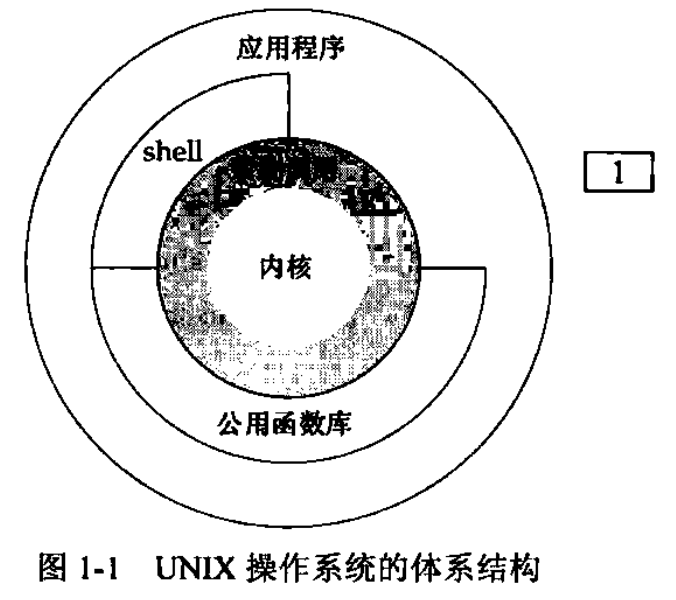
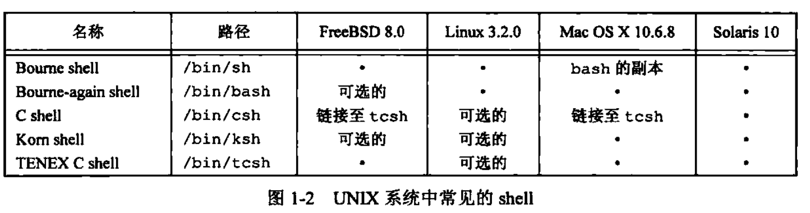

<h1 align="center">📒 第 01 章 UNIX基础知识 学习笔记</h1>

## 1. UNIX体系结构
操作系统可以定义控制计算机硬件资源，提供程序运行环境的一种软件。通常称其为内核。位于环境的核心。UNIX系统的体系结构示意图如下：



- 各个模块的说明：
    - 阴影部分：系统调用，是内核与外部层交互的接口。
    - 应用程序既可以使用公共函数也可以使用系统调用。
    - shell：为运行其它应用程序提供的一个接口。

## 2. 登录

- 登录名
    - 系统将登录名存在口令文件 `/etc/passwd`。登录项由7个以冒号分割的字段组成：
        - 登录名、加密口令、数字用户ID（205）、数字组（105）、注释字段、起始目录（`/home/sar`）、shell程序（`/bin/ksh`）。

- 在Unix系统中常见的shell根据分支不同，使用不同的shell格式：
  
    

## 3. 文件和目录

- 文件系统
    - UNIX文件系统是目录和文件的一种层次结构。
    - 所有东西的起点是`根目录("/")`。
    - 目录项都包含一个文件名和文件属性信息，而文件属性则包含文件类型、文件大小、文件所有者、文件权限、文件最后修改时间等。
  
- 文件名
    - 目录的各个名字称为`文件名`。
    - `斜线(/)` 和`空字符`不能出现在文件名中。
        - 斜线分隔构成路径名的各个文件名字。
        - 空字符则终止一个路径名。
    - 创建新目录时会自动创建了两个文件名:`.(称 点)` 和 `.. (称为点点) `
        - 点指向当前目录， 点点指向父目录。在最高层次的根目录中，点点与点相同。
- 路径名
    - 由斜线分隔的一个或多个文件名组成的序列 (也可以斜线开头)构成路径名 (pathname )。
    - 以`斜线开头`的路径名称为`绝对路径名(absolutepathname)`.
    - `相对路径名`指向相对于当前目录的文件。
    - 文件系统`根(/ )`是一个`特殊`的绝对路径名，它不包含文件名。
  
- 工作目录
    - 每个进程都有一个工作目录，也称为当前工作目录。
    - 进程可以用 chdir 函数更改其工作目录。

- 起始目录
    - 起始目录从口令文件中的相应用户的登录项中获得。


## 4. 输入和输出

- 文件描述符
    - 文件描述符是一个小的非负整数，内核用来标识一个特定进程正在访问的文件。

- 标准输入、标准输出和标准错误
    - 每运行一个新程序时，shell都会打开`3个文件描述符（标准输入、标准输出和标准错误）`。

- 不带缓冲的I/O
    - 函数`open、read、write、lseek`提供了不带缓冲的I/O，都使用文件描述符的方式。

- 标准I/O
    - 使用标准I/O函数无需担心如何选取最佳的缓冲区大小。
    - 简化了对输入行的处理。
    - 典型：`printf()` 函数。

## 5. 程序和进程
- 程序
    - 一个存储在磁盘上某个目录的可执行文件。

- 进程和进程ID
    - 程序的执行实例称为进程。
    - 进程ID总是一个非负整数。是每一个进程的唯一的数字标识符。代码文件：[01.getpid.c](./src/01.getpid.c)

- 进程控制
    
    - 有3个主要函数：fork、exec 和 waitpid。代码实例：[02.process_control_example.c](./src/02.process_control_example.c)

- 线程和线程ID

    - 一个进程只有一个控制线程（thread）。
        - 某一时刻执行的一组机器指令。
    - 一个进程内的所有线程共享同一个地址空间、文件描述符、栈以及进程相关的属性。

## 6. 出错处理
当Unix系统函数出错时，通常会返回一个负值的errno。
- errno定义在头文件 `<errno.h>` 中。

在使用 errno应当注意两条规则：

- 如果没有出错，其值不会被例程消除
- 任何函数都不会将 `errno值` 设置为`0`，在头文件中 `<errno.h>` 也不会定义为0。


在C语言中定义了两个函数，用于打印出错信息：

```c
#include <string.h>
#include <stdio.h>

char *strerror(int errnum); // 将errnum映射为一个出错信息字符串，并返回此字符串的指针
void perror(const char *msg); // 基于当前值，在标准错误上产生一条出错信息，然后返回
```

## 7. 用户标识
- 用户ID
    - 用户ID是一个数值，向系统标识各个不同的用户。
    - 系统管理员在确定一个用户的登录名时，确定其用户ID
    - 每个用户不能修改其用户ID，且只有一个唯一的用户ID。
    - 用户ID为`0`的用户为 `root用户` 或者 `超级用户`。

- 组ID
    - 组ID也是系统管理员在指定用户登录名时分配的。
    - 允许`同组`的各个成员之间`共享资源`。
    - 组文件将组名映射为数值的组ID。组文件通常是 `/etc/group`。

代码源文件：[03.getuid_getgid.c](./src/03.getuid_getgid.c)

```c
/***************************************************
 * 
 * 描述：获取用户ID和组ID
 * 
 * **************************************************
 */

#include <stdio.h>
#include <unistd.h>
#include <stdlib.h>

int main(void)
{
    printf("uid = %d gid = %d\n", getuid(), getgid());
    exit(0);
}
```

- 附属组ID
    - 允许一个用户属于多至16个其它的组。


## 8. 信号
信号用于告知进程发生了某中情况。进程处理3种处理信号的方式：

- 忽略信号
    - 某些异常产生的后果不确定，所以不推荐使用。

- 按系统默认方式处理
    - 如果除数为0，则系统默认是终止进程。

- 提供一个函数，信号发生时调用函数，这称为捕捉该信号。

在终端键盘上产生信号的两种方法（主要用于中断当前运行的进程）：

- 中断键（`Delete 或者 Ctrl + C`） 和 退出键（`Ctrl + \`）
- 调用 `kill()` 函数。


代码案例：[04.catch_signal.c](./src/04.catch_signal.c)

## 9. 时间值
Unix 系统使用过两种时间值：

- 日历时间
    - `UTC`时间（从1970年1月1日 00:00:00经过的秒数累计值）
    - 系统基本数据类型 `time_t` 用于保存这个时间值。

- 进程时间
    - 也称CPU时间。用于度量进程使用的CPU资源。
    - 以`时钟click`计算。
    - 系统基本类型 `clock_t` 保存该值。

当度量一个进程的执行时间时，Unix为一个进程维护了3个进程时间值：

- 时钟时间
    - 墙上时钟时间，是进程运行的时间总量。与系统中同时运行的进程数有关。
- 用户CPU时间
    - 执行用户指令所用的时间量。

- 系统CPU时间
    - 为该进程执行内核程序所经过的时间。

## 10. 系统调用和库函数
- 系统调用和库函数都以C函数的形式出现，两者都为应用程序提供服务。
    - 可以替换库函数，但系统调用一般不能替换。

- 系统调用提供一种最小接口，而库函数通常提供比较复杂的功能。
