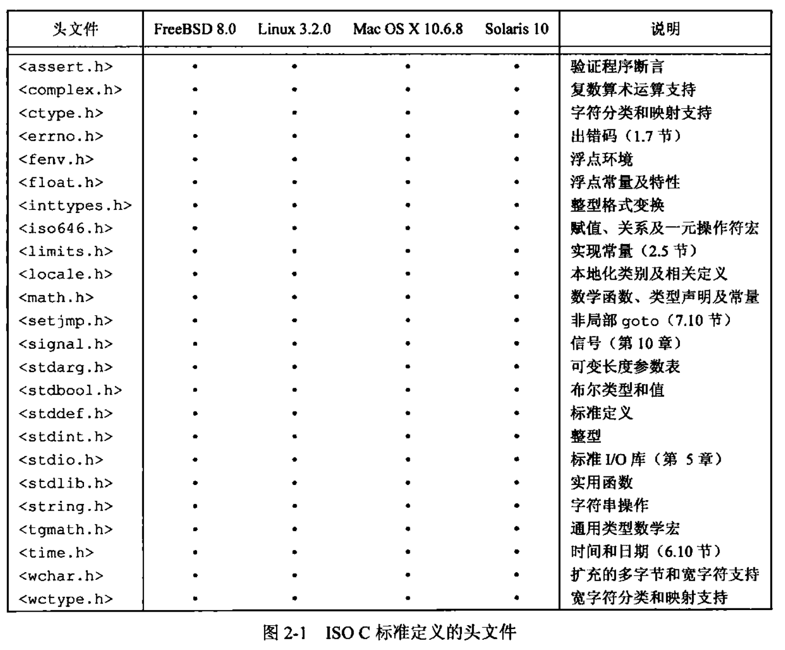

<h1 align="center">📒 第 02 章 UNIX标准及实现 学习笔记</h1>


## 1. UNIX标准化


### 1.1 ISO C
ANSI：美国国家标准学会(AmericanNationalStandardsInstitute)

IEC：国际电子技术委员会(Inter ational ElectrotechnicalCommission)

ISO C标准的目的：提供C程序的可移植性，使其能适合于不同的OS，不仅仅是适合UNIX系统。此标准不仅定义了C程序设计语言的语法和语义，还定义了其标准库。现今的UNIX系统都提供C标准中定义的库函数。

1999年，ISO C标准更新。并在后续技术的演化，也更新了多个版本的ISO C标准。

按ISO C标准定义的各个头文件，可将其分为24个区。ISO C头文件依赖于OS所配置的C编译器的版本。




### 1.2 IEEE POSIX
POSIX 指的是可移植操作系统接口（Portable Operating System Interface），一个最初由IEEE（Institute of Electrical and Electronics Engineers）制定的标准族。

- 目的：提升应用程序在各种UNIX系统之间的可移植性。
- 定义了 “符合POSIX的” OS必须提供的各种服务。
- 标准只说明一个接口而不是一种实现。

### 1.3 Single UNIX Specification
SUS（单一UNIX规范）是POSIX.1 标准的一个超集，定义了一些附加接口扩展了 POSIX.1 规范提供的功能。POSIX.1 中定义的接口称为 X/Open系统接口（X/Open System Interface，XSI）。

### 1.4 FIPS
FIPS：联邦信息处理标准（Federal Information Processing Standard）

- 由美国政府发布。

- 很多更新版本的标准都是基于IEEE标准的基础上更新，强制要求支持POSIX标准。


## 2. UNIX系统实现
UNIX演化出三个分支版本：

- AT&T分支
- 加州伯克利分校分支
- AT&T贝尔实验室的计算机研究中心开发的UNIX分时系统版本

### 2.1 SVR4
- SVR4（UNIX System V Release 4）是AT&T的Unix系统实验室的产品。它融合了 SVR3.2、SunOS、4.3BSD和Xenix的功能。

- SVR4符合POSIX 1003.1 标准和 X/Open XPG3标准。

### 2.2 4.4BSD
- BSD（Berkeley Software Distribution）是由加州大学伯克利分校的计算机系统研究组（CSRG）研究开发和分发的版本。

- 1994年，4.4BSD-Lite是CSRG计划的最后一个发行版。

### 2.3 FreeBSD
- FreeBSD是基于 4.4BSD-Lite OS开发的版本，也是伯克利分校开发的项目。
- 后续在FreeBSD项目上产生的所有软件，包括二进制代码和源代码，都是免费使用。


### 2.4 Linux
- Linux是一种提供类似UNIX的丰富编程环境的操作系统。在GNU许可证下，Linux免费使用。

- Linux由Linus Torvalds在1991年为替代MINIX而研发。

### 2.5 Mac OS X
- Mac OS X的核心操作系统是 "Darwin"，基于Mach内核、FreeBSD以及面向对象框架的驱动和内核扩展的结合。

- 早期存在于乔布斯的 Next公司的项目。

### 2.6 Solaris
- Solaris是Sun Microsystem（现Oracle）开发的UNIX版本。

### 2.7 其它Unix系统
通过验证的UNIX版本：

- AIX，IBM版
- HP-UX，HP版
- IRIX，Silicon Graphics版
- UnixWare，SVR4衍生出

## 3. 限制
两种类型的限制：

- 编译时限制
- 运行时限制

编译时限制可在头文件中定义。程序在编译时可以包含着头文件，但运行时限制则要就进程调用一个函数获得限制值。

某些限制在一个给定的实现中可能是固定的（可以静态在一个头文件中定义），而在另一个实现中则可能是变动的（需要一个运行时函数调用）。

为了解决这类问题，提供了3种限制：

- 编译时限制（编译选项定义在头文件 `<unistd.h>` 中）
- 与文件或目录无关的运行时限制（`sysconf`函数）
- 与文件或目录有关的运行时限制（`pathconf` 和 `fpathconf`函数）

使事情变得更加复杂的是，如果一个特定的运行时限制在一个给定的系统上并不改变，则可将其静态地定义在一个头文件中，但是，如果没有将其定义在头文件中，则应用程序必须调用三个conf函数中的一个，以确定其运行的值。

### 3.1 ISO C限制
- ISO C定义的所有编译时限制都列在头文件 <limits.h> 中。

### 3.2 POSIX限制
POSIX.1 定义了很多涉及OS实现限制的常量。虽然定义了大量限制和常量，但只关心与基本POSIX.1 接口相关的，可以分为7类：

- 数值限制
- 最小值
- 最大值
- 运行时可以增加的值
- 运行时不变值（可能不确定）
- 其它不变的值
- 路径名可变值

### 3.3 XSI限制
XSI定义了代表实现限制的几个常量

- 最小值
- 运行时不变值（可能不确定）：IOV_MAX 和 PAGE_SIZE。

### 3.4 数sysconf、pathconf和fpathconf
运行时限制可调用3个函数之一获得：

```c
#include <unistd.h>

long sysconf(int name); // 标识系统限制
long pathconf(const char* pathname, int name); // 以为
long fpathconf(int fd, int name);
```

以`_SC_`开始的常量用作标识`运行时`限制的`sysconf`参数。以`_PC_`开始的常量用作标识`运行时`限制的`pathconf`或`fpathconf`参数


对于`pathconf`的参数`pathname`以及`fpathconf`的参数`fd`有一些限制。如果不满足其中任何一个限制，则结果是未定义的

- `_PC_MAX_CANON` 和 `_PC_MAX_INPUT` 所引用的文件必须是`终端文件`

- `_PC_LINK_MAX`所引用的文件可以是`文件或目录`。如果是`目录`，则返回值用于`目录本身`（而不是用于目录内的文件名项）

- `_PC_FILESIZEBITS`和`_PC_NAME_MAX`所引用的文件必须是`目录`，返回值用于该目录中的`文件名`

- `_PC_PATH_MAX`引用的文件必须是目录。当所指定的目录是工作目录时，返回值是相对路径名的最大长度（

- `_PA_PIPE_BUF`所引用的文件必须是`管道`、`FIFO或目录`。在管道或FIFO情况下，返回值是对所引用的管道或FIFO的限制值。对于目录，返回值是对该目录中创建的任意FIFO的限　制值

- `_PC_SYMLINK_MAX`所引用的文件必须是目录。返回值是该目录中符号链接可能包含的字符串的最大长度

代码实例：打印pathconf和sysconf符号的值 [](./src/01.print_pathconf_sysconf_value.c)


UFS 是Berkeley 快速文件系统的SVR4实现，PCFS是 Solaris的 MS-DOS文件系统的实现。

### 3.5 不确定的运行时限制

如果限制值没有在头文件 <limit.h> 中定义，编译时就不能使用，如果对应的值不确定，那么在运行时可能也是未定义的。

- 路径名
    - 程序一般就会在编译时为路径名分配存储区。
    - 代码实例：[02.for_path_allocate_memory.c](./src/02.for_path_allocate_memory.c)

- 最大打开文件数
    - 守护进程：在后台运行且不与终端相连接的一种进程。
    - 常见的代码实例是关闭所有打开文件。
    - 代码实例：[03.determinate_file_description_num.c](./src/03.determinate_file_description_num.c)


## 5. 选项

对于限制的处理，POSIX.1提供了3种选项：

- 编译时限制（编译选项定义在头文件 `<unistd.h>` 中）
- 与文件或目录无关的运行时限制（`sysconf`函数）
- 与文件或目录有关的运行时限制（`pathconf` 和 `fpathconf`函数）

对于每一个选项，也有以下3种可能的平台支持状态：

- 如果符号常量没有定义或者定义值为-1，那么该平台在编译时并不支持相应选项。但是有一种可能，即在已支持该选项的新系统上运行老的应用时，即使该选项在应用编译时未被支持， 但如今新系统运行时检查会显示该选项已被支持。

- 如果符号常量的定义值大于0，那么该平台支持相应选项。

- 如果符号常量的定义值为0，则必须调用 `sysconf`、`pathconf` 或者 `fpathconf` 来判断选项是否受到支持。

## 6. 功能测试宏
如果在编译一个程序时，希望它只与 POSIX的定义相关，而不与任何实现定义的常量冲突，则就需要定义常量 `_POSIX_C_SOURCE`。这种常量称为`功能测试宏`。所有的功能测试宏都以`下划线`开始。使用时，用cc命令行中下列定义：

```shell
cc -D_POSIX_C_SOURCE=200808L file.c
```

通过C语言的方式，可以在源文件中定义：

```c
#define _POSIC_C_SOURCE 200809L
```

## 7. 基本系统数据类型
头文件 `<sys/types.h>` 中定义了与实现有关的数据类型，称为基本系统数据类型。都是使用C的 `typedef` 来定义的，大多数以 `_t` 结尾。


