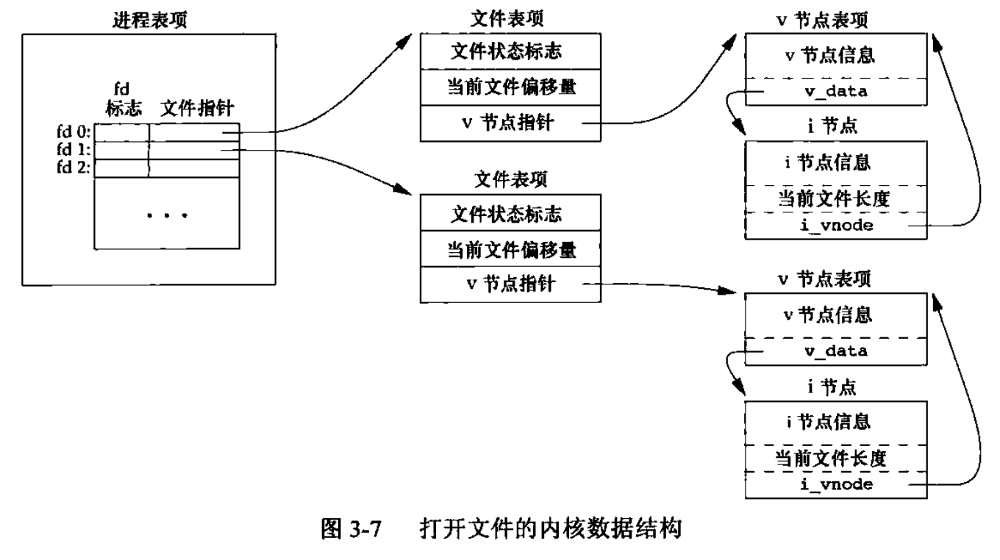
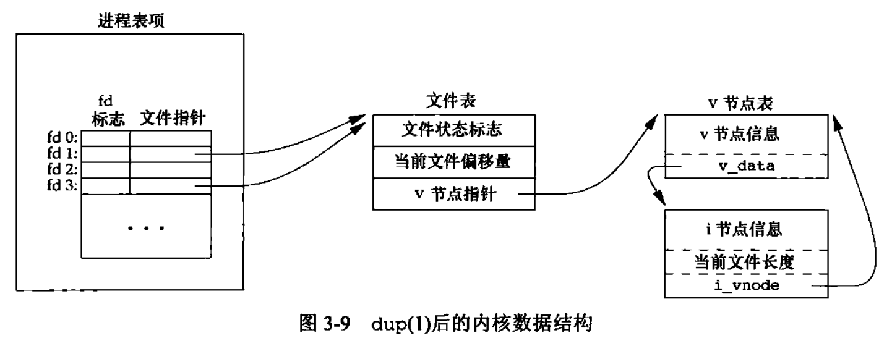

<h1 align="center">📒 第 03 章 文件I/O 学习笔记</h1>


## 1. 文件描述符
对内核而言，所有打开的文件都是通过`文件描述符`。文件描述符是一个`非负整数`。

惯例：Unix系统shell把文件描述符0与进程的标准输入关联，文件描述符1与标准输出关联，文件描述符2与标准错误关联。在POSIX.1中，对应被替换为符号常量 `STDIN_FILENO`、`STDOUT_FILENO` 和 `STDERR_FILENO` 以提高可读性。


文件描述符的变化范围：`0 ～ OPEN_MAX - 1`。

## 2. 函数open和openat
调用 open() 或 openat() 函数可以打开或者创建一个文件。

```c
#include  <fcntl.h>

// 注意：... 在ISO C中余下的参数数量和类型是可变的。

int open(const char *path, int oflag, ... /* mode_t mode */);
int openat(int fd, const char *path, int oflag, ... /* mode_t mode */);
```

- path是要打开或者创建文件的名字。
- oflags说明函数的选项，定义在头文件 `<fcntl.h>` 中。
- fd参数有3种可能性：
    - path是`绝对路径名`，fd可以`忽略`，此时openat和open相同。
    - path是`相对路径名`，fd指出`路径名在文件系统中的开始地址`。通过打开相对路径名所在的目录来获取。
    - path指定了`相对路径名`，fd参数具有特殊值 `AT_FDCDW`，此时路径名在当前工作目录中获取。操作上openat和open相似。

对于一些常见的oflags参数选项：

|选项|描述|
|--|--|
|O_RDONLY|只读打开|
|O_WRONLY|只写打开|
|O_RDWR|读、写打开|
|O_EXEC|只执行打开|
|O_SEARCH|只搜索打开|
|O_APPEND|每次写时都追加到文件的尾端。|
|O_CLOEXEC|把 FD_CLOEXEC常量设置为文件描述符标志|
|O_CREAT|若此文件不存在则创建它。使用此选项时，open函数需同时说明第3个参数mode，用mode指定该新文件的访问权限位。|
|O_DIRECTORY|如果path引用的不是目录，则出错|
|O_EXCL|如果path同时指定了O_CREAT，而文件已经存在，则出错。可以用来测试一个文件是否存在，如果不存在，则创建此文件。|
|O_NOCTTY|如果path引用的是终端设备，则不将该设备分配作为此进程的控制终端|
|O_NOFOLLOW|如果path引用的是一个符号链接，则出错|
|O_NONBLOCK|如果path引用的是一个FIFO、一个块特殊文件或者一个字符特殊文件，则选项为文件的本次打开操作和后续I/O操作设置为非阻塞方式|
|O_SYNC|使每次write等待物理I/O操作完成，包括由write操作引起的文件属性更新为所需的I/O|
|O_TRUNC|如果此文件存在，而且为只写或者读-写成功打开，则将其长度截断为0|
|O_TTY_INIT|如果打开一个还未打开的终端设备，设置非标准termios参数值，使其符合 Single UNIX Specification 中同步输入和输出选项的一部分。|
|O_DSYNC|使每次write要等待物理I/O操作完成，但如果该写操作并不影响读取刚写入的数据，则不需要等待文件属性被更新|
|O_RSYNC|使每个以文件描述符作为参数的read操作等待，甚至所有对文件同一部分挂起的写操作都完成|

## 3. 函数creat

```c
#include <fcntl.h>

int creat(const char *path, mode_t mode); // 只写方式打开所创建的文件

// 与open的如下用法等效
open(path, O_WRONLY| O_CREAT | O_TRUNC, mode);
```

## 4. 函数close
关闭一个打开文件。

```c
#include <unistd.h>

int close(int fd);
```
关闭一个文件时还会关闭该进程在该文件上的所有记录锁。

当一个进程终止时，内核自动关闭它所有的打开文件。

## 5. 函数lseek
每个打开文件都有一个与其相关联的 “当前文件偏移量”。用以度量从文件开始处计算的字节数。为打开文件设置偏移量。

```c
#include <unistd.h>

off_t lseek(int fd, off_t offset, int whence);
```

参数说明

- 若whence是 `SEEK_SET`，则该文件的偏移量设置为距文件`开始处 offset`个字节。
- 若whence是 `SEEK_CUR`，则该文件的偏移量设置为其`当前值加 offset`， offset可正或负。
- 若whence是 `SEEK_END`，则该文件的偏移量设置为`文件长度加 offset`，offset可正或负
。

如果文件描述符指向的是一个`管道、FIFO或者网络套接字`，则`lseek`返回`-1`，并将`errno`设置为 `ESPIPE`。

代码实例：[01.print_offset.c](./src/01.print_offset.c)

```c
#include <stdio.h>
#include <fcntl.h>
#include <unistd.h>
#include <stdlib.h>

int main(void)
{
    if (lseek(STDIN_FILENO, 0, SEEK_CUR) == -1) {
        printf("cannot seek\n");
    } else {
        printf("seek ok\n");
    }
    exit(0);
}
```

lseek仅将当前的文件偏移量记录在内核中，它并不引起任何I/O操作。该偏移量主要用于下一个读或写操作。

对于文件偏移量可以大于文件的当前长度，对该文件的下一次写将加长该文件，并在文件中构成一个空洞。文件中的空洞并不要求在磁盘上占用存储区。

空洞文件：[02.create_hole_file.c](./src/02.create_hole_file.c)

## 6. 函数read

```c
#include <unistd.h>

ssize_t read(int fd, void *buf, size_t nbytes);
// 如read成功，则返回读到的字节数，如已达到文件的尾端，则返回0
```

有多种情况可使实际读到的字节数少于要求读的字节数：

- 读`普通文件`时，在读到要求字节数之前已达到了文件尾端。
- 当从`终端设备`读时，通常一次最多读一行。
- 当从`网络`读时，网络中的缓冲机制可能造成返回值小于所要求读的字节数。
- 当从`管道或FIFO`读时，如果管道包含的字节少于所需的数量，则read将只返回实际可用的字节数。
- 当从某些`面向记录的设备`读时，一次最多返回一个记录。
- 当一`信号造成中断`，而已经读了部分数量时。读操作从文件的偏移量处开始，在成功返回之前，该偏移量将增加实际读到的字节数。

## 7. 函数write
调用 write 函数向打开文件写数据。

```c
#include <unistd.h>

ssize_t write(int fd, const void *buf, size_t nbytes);
```

- 返回值与参数nbytes的值相同，否则表示出错。

- write出现的常见原因：磁盘已写满，或超过一个给定进程的文件长度限制。

- 对于普通文件，写操作从文件的当前偏移量处开始。
    - 如果在打开该文件时，指定了O_APPEND 选项，则在每次写操作之前，将偏移量设置在文件的当前结尾处。


## 8. I/O的效率
演示程序：[03.use_read_write_to_copy_file.c](./src/03.use_read_write_to_copy_file.c)


```c
#include <unistd.h>
#include <stdio.h>
#include <stdlib.h>

#define BUFFSIZE 4096

int main(void)
{
    int n;
    char buf[BUFFSIZE];

    while ((n == read(STDIN_FILENO, buf, BUFFSIZE)) > 0) {
        if (write(STDOUT_FILENO, buf, n) != n) {
            printf("write error");
        }
    }

    if (n < 0) {
        printf("read error");
    }
    exit(0);
}
```

大多数文件系统为改善性能都采用某种`预读（read ahead）`技术。

## 9. 文件共享
UNIX系统支持在不同进程间共享打开文件。

内核使用3种数据结构表示打开文件，他们之间的关系决定了在文件共享方面一个进程对另一个进程可能产生的影响。



- 每个进程在进程表项中都一个记录项，记录项中包含一张打开文件描述符表。描述符中包含：
    - 文件描述符标志
    - 指向一个文件表项的指针

- 内核为所有打开文件维持一张文件表，每个文件表包含：
    - 文件状态标志
    - 当前文件偏移量
    - 指向该文件v节点表项的指针

- 每个打开文件（或设备）都一个一个v节点（v-node）结构。包含：
    - 文件类型
    - 对文件操作函数的指针

## 10. 原子操作
- 追加到一个文件
    - 如果一个进程要将数据追加到一个文件尾端。早期不支持open时的程序：

        ```c
        if (lseek(fd, OL, 2) < 0) {
            printf("lseek error");
        }
        if (write(fd, buf, 100) != 1000) {
            printf("write error");
        }
        ```
        - 对于单个进程来说，程序正常，但是多个进程同时操作时，就会产生问题。

- 函数pread 和 pwrite
    - SUS中包含了XSI扩展，允许原子性地定位并执行I/O。
  
        ```c
        #include <unistd.h>

        ssize_t pread(int fd, void *buf, size_t nbytes, off_t offset);
        ssize_t pwrite(int fd, )
        ```

    - 调用pread相当于调用lseek后调用read。注意点：pwrite也存在同样区别。
        - 调用pread时，无法中断其定位和读操作。
        - 不更新当前文件偏移量。

原子操作指的是由多步组成的一个操作。如果操作原子地执行，则要么执行完所有步骤，要么一步不执行。不可能只执行所有步骤的一个子集。


## 11. 函数dup和dup2
复制一个现有的文件描述符。

```c
#include <unistd.h>

int dup(int fd); // 返回最小数值且没被占用的文件描述符
int dup2(int fd, int fd2); // 

// 返回值：成功，返回新的文件描述符，失败则返回-1
```

- dup2中，如果fd2已经打开，则先将其关闭，如果fd2没有打开文件，则fd2直接指向fd相同的文件。

函数返回的新文件描述符与参数fd共享一个文件表项。



每个文件描述符都有各自的一套文件描述符标志。对于描述符的执行时关闭标志都是由dup函数消除。

## 12. 函数`sync`、`fsync`和`fdatasync`
  
当内核需要重用缓冲区来存放其它磁盘块数据时，会把所有延迟写数据块写入磁盘。为了保证磁盘上实际文件系统与缓冲区中内容的一致性，UNIX提供了 sync、fsync 和 fdatasync 函数。

```c
#include <unistd.h>

int fsync(int fd);
int fdatasync(int fd);

void sync(void);
```

- sync 只将所有修改过的块缓冲区排入写队列，然后就返回，不等待实际写磁盘操作结束。

- fsync 只对由文件描述符fd指定的一个文件起作用，等待写磁盘操作结束后才返回。

- fdatasync 类似于 fsync，但只影响文件的数据部分，除数据外，fsync会同步更新文件的属性。

## 13. 函数fcntl
fcntl 函数可以改变已经打开文件的属性。

```c
#include <fcntl.h>

int fcntl(int fd, int cmd, ... /* int arg */); // 第三个参数总是一个整数
```

fcntl 函数有5种功能：

- 复制一个已有的描述符（`cmd = F_DUPFD` 或者 `F_DUPFD_CLOEXEC`）
- 获取/设置文件描述符标志（`cmd = F_GETFD` 或 `F_SETFD`）
- 获取/设置文件状态标志（`cmd = F_GETFL` 或 `F_SETFL`）
- 获取/设置异步I/O所有权（`cmd = GETOWN` 或 `F_SETOWN`）
- 获取/设置记录锁（`cmd = F_GETLK`、`F_SETLK`或`F_SETLKW`）

cmd中有8种与记录锁有关：

|cmd类型|描述|
|--|--|
|`F_DUPFD`|复制文件描述符fd。新文件描述符作为函数值返回。是尚未打开的各描述符中大于或等于第3个参数值中各值的最小值。|
|`F_DUPFD_CLOEXEC`|复制文件描述符，设置与新描述符关联的 FD_CLOSEXEC文件描述符标志的值，返回新文件描述符|
|F_GETFD|对应于fd的文件描述符标志作为函数值返回。|
|F_SETFD|对fd设置文件描述符标志。新标志值按第3个参数（取为整型值）设置。|
|F_GETFL|对fd的文件状态标志作为函数值返回。状态标志参考open函数中的oflags选项值。|
|F_SETFL|将文件状态标志设置为第3个参数的值（取为整型值）。|
|F_GETOWN|获取当前接收SIGIO和SIGURG信号的进程ID或者进程组ID。|
|F_SETOWN|设置接收SIGIO 和 SIGURG 信号的进程ID和进程组ID。正的arg指定一个进程ID，负的arg表示等于arg绝对值的一个进程组ID|

fcntl 的返回值与命令有关。如果出错，所有命令都返回-1，如果成功则返回某个其它值。


## 14. 函数ioctl
ioctl 一直用来进行I/O操作，也是操作终端I/O最多的地方。

```C
#include <unistd.h> // system V
#include <sys/ioctl.h> // BSD and Linux

int ioctl(int fd, int request, ...);
```

每个设备驱动程序可以定义自己专用的一组ioctl命令，系统则为不同种类的设备提供通用的ioctl命令。


## 15. /dev/fd

在最新的系统中提供名为 /dev/fd 的目录，其目录项是名为 0、1、2等的文件，打开文件 /dev/fd/n 等效于复制描述符n。

```c
fd = open("/dev/fd/0", mode);

fd = open("/dev/fd/0", O_RDWR);
```

在某些系统提供路径名 `/dev/stdin`、`/dev/stdout` 和 `/dev/stderr`，等效于 `/dev/fd/0`、`/dev/fd/1` 和 `/dev/fd/2`。

- /dev/fd 文件主要由shell使用，允许使用路径名作为调用参数的程序，能用处理其他路径名的相同方式处理标准输入和输出。
