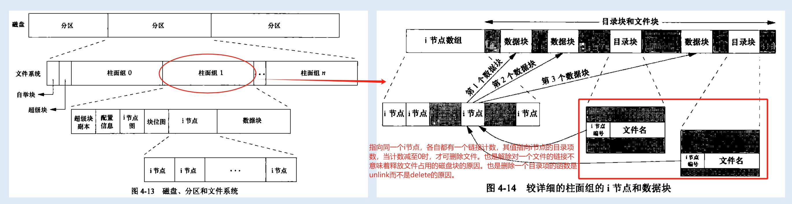
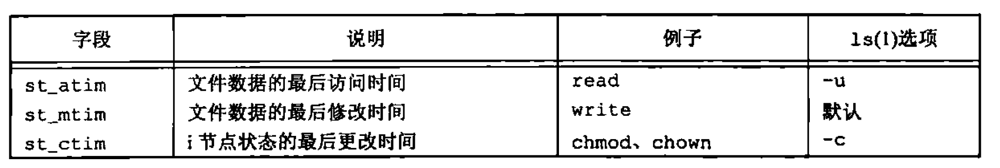
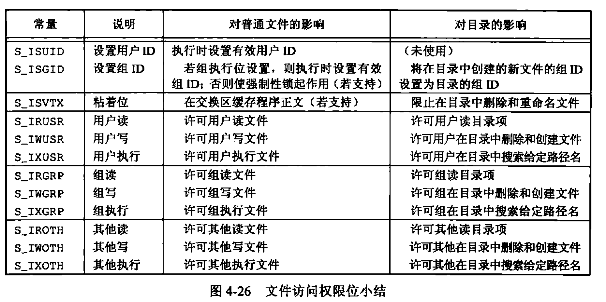

<h1 align="center">📒 第 04 章 文件和目录 学习笔记</h1>


## 1. 函数 stat、fstat、fstatat 和 lstat

```c
#include <sys/stat.h>

int stat(const char *restrict pathname, struct stat *restrict buf);
int fstat(int fd, struct stat *buf);
int lstat(const char *restrict pathname, struct stat *restrict buf);
int fstatat(int fd, const char *restrict pathname, struct stat *restrict buf, int flag);
```

- stat 返回与命名文件有关的信息结构。
- fstat 获得已在描述符fd上打开文件的有关信息。
- lstat 返回符号链接的有关信息，而不是由符号链接引用的文件的信息。
- fstatat 为一个相对于当前打开目录（fd指向）的路径名返回文件统计信息。flag来决定是否跟随一个符号链接。


buf 参数是一个指向结构体的指针。基本形式如下：


```C
struct stat {
    mode_t st_mode; // file type & mode (permissions)
    ino_t st_ino; // i-node number (serial number)
    dev_t st_dev; // device number (file system)
    dev_t st_rdev; // device number for special files
    nlink_t st_nlink; // numbers of links
    uid_t st_uid; // user ID of owner
    gid_t st_gid; // group ID of owner
    off_t st_size; // size in bytes, for  regular files
    struct timespec st_atime; // time of last modification
    struct timespec st_mtime; // time of last modification
    struct timespec st_ctime; // time of last file status change
    blksize_t st_blksize; // best I/O block size
    blkcnt_t st_blocks; // number of disk blocks allocated
};

struct timespec {
    time_t tv_sec; // 秒
    time_t tv_nsec; // 纳秒
    // ... ...
};
```

获取文件的信息，`ls -l` 命令是使用`stat`函数最多的位置。

## 2. 文件类型

主要有几种文件类型（宏定义在头文件 `<sys/stat.h>` 中）：

|文件类型|描述|宏|
|--|--|--|
|普通文件（regular file）||`S_ISREG()`|
|普通文件（regular file）||`S_ISDIR()`|
|块特殊文件（block special file）|针对设备带缓冲的访问，每次访问以固定长度为单位进行。FreeBSD已不支持。|`S_ISCHR()`|
|字符特殊文件（character special file）|对设备不带缓冲的访问，每次访问长度可变。设备要么是字符特殊文件，要么是块特殊文件。|`S_ISBLK()`|
|FIFO|管道，用于进程间通信。|`S_ISFIFO()`|
|套接字（socket）|用于进程间的网络通信。|`S_ISLNK()`|
|符号链接（symbolic link）||`S_ISSOCK()`|


POSIX.1 允许将进程间通信（IPC）对象说明为文件。

|宏|对象的类型|
|--|--|
|`S_TYPEISMQ()`|消息队列|
|`S_TYPEISSEM()`|信号量|
|`S_TYPEISSHM()`|共享存储对象|


[01.args_to_print_file_type.c](./src/01.args_to_print_file_type.c)

```c
#include <stdio.h>
#include <sys/stat.h>
#include <stdlib.h>

int main(int argc, char *agrv[]) {
    int i;
    struct stat buf;
    char *ptr;

    for (i = 1; i < argc; i++) {
        printf("%s: ", agrv[i]);

        if (lstat(agrv[i], &buf) < 0) {
            printf("lstat error");
            continue;
        }
        if (S_ISREG(buf.st_mode)) {
            ptr = "regular";
        } else if (S_ISDIR(buf.st_mode)) {
            ptr = "directory";
        } else if (S_ISCHR(buf.st_mode)) {
            ptr = "character special";
        }else if (S_ISBLK(buf.st_mode)) {
            ptr = "block special";
        } else if (S_ISFIFO(buf.st_mode)) {
            ptr = "FIFO";
        } else if (S_ISLNK(buf.st_mode)) {
            ptr = "symbolic link";
        }else if (S_ISSOCK(buf.st_mode)) {
            ptr = "socket";
        } else {
            ptr = "** unknown mode **";
        }
        printf("%s\n", ptr);
    }
    exit(0);
}
```

对于Linux系统来说，普通文件是最主要的文件类型。


## 3. 设置用户ID和设置组ID
与进程有关联的ID有6个或更多:

- 我们实际上是谁？
    - 实际用户ID
    - 实际组ID
    - 主要在登录时取口令文件中的登录项。

- 用于文件访问权限检查
    - 有效用户ID
    - 有效组ID
    - 附属组ID

- 由 exec函数保存

    - 保存的设置用户ID
    - 保存的设置组ID
    - 执行一个程序时包含了有效用户ID和有效组ID的副本。

通常，`有效用户ID = 实际用户ID，有效组ID = 实际组ID`。

对于设置`用户ID`和`组ID`，可以在`stat`函数中，将 `st_mode` 值设置为 `S_ISUID` 和 `S_ISGID` 。

## 4. 文件访问权限
所有文件类型（目录、字符特殊文件等）都有访问权限。每个文件有9个访问权限位，将其分为3类：

|st_mode |含义|
|--|--|
|`S_IRUSR`|用户读|
|`S_IWUSR`|用户写|
|`S_IXUSR`|用户执行|
|`S_IRGRP`|组读|
|`S_IWGRP`|组写|
|`S_IXGRP`|组执行|
|`S_IROTH`|其它读|
|`S_IWOTH`|其它写|
|`S_IXOTH`|其它执行|

用户指的是文件所有者。chmod 命令主要用于修改对应的权限位。

进程每次打开、创建或者删除一个文件时，内核就进行文件访问权限测试。主要进行的测试如下：

- 若进程的有效用户ID 是0（超级用户），则允许访问。

- 若进程的有效用户ID等于文件的所有者ID（进程拥有此文件），则文件所有者的权限位被设置，则允许访问，否则直接拒绝。

- 若进程的有效组ID或进程的附属组ID之一等于文件的组ID，则组的访问权限位被设置，则允许访问，否则拒绝访问。

- 若其它用户适当的访问权限位被设置，则允许访问，否则拒绝访问。


## 5. 新文件和目录的所有权
新文件的用户ID设置为进程的有效用户ID。对于组ID可以是进程的有效组ID，也可以是所在目录的组ID。

`mkdir` 函数要自动传递一个目录的设置组ID位。


## 6. 函数access 和 faccessat
access 和 faccessat 函数是按实际用户ID和实际组ID进行访问权限测试。

```c
#include <unistd.h>

int access(const char *pathname, int mode);
int faccessat(int fd, const char *pathname, int mode, int flag);
```

如果测试文件是否已经存在，mode为 F_OK，否则mode为如下标志位：

|mode|说明|
|--|--|
|R_OK|测试读权限|
|W_OK|测试写权限|
|X_OK|测试执行权限|

两个函数在以下情况下是相同的：

- `pathname` 为`绝对路径`
- fd取值为 `AT_FDCWD`，而`pathname` 为`相对路径`。

flag参数用于改变 `faccessat` 的行为。如果`flag`为 `AT_EACCESS`，访问检查用的是调用进程的有效用户ID和有效组ID，而不是实际用户ID 和 实际组ID。

[02.test_access_function.c](./src/02.test_access_function.c)

```c
#include <fcntl.h>
#include <stdlib.h>
#include <stdio.h>
#include <unistd.h>

int main(int argc, char *argv[]) {
    if (argc != 2) {
        printf("usage : a.out <pathname>");
    }
    if (access(argv[1], R_OK) < 0) {
        printf("access error for %s", argv[1]);
    } else {
        printf("read access OK\n");
    }

    if (open(argv[1], O_RDONLY) < 0) {
        printf("open error for %s", argv[1]);
    } else {
        printf("open for reading OK\n");
    }

    exit(0);
}
```


## 7. 函数umask
umask 函数为进程设置文件模式创建屏蔽字，并返回之前的值。

```c
#include <sys/stat.h>

mode_t umask(mode_t cmask); // cmask的值是文件访问权限中的常量值之一。
```

对于函数测试：[03.test_umask_function.c](./src/03.test_umask_function.c)

```c
#include <fcntl.h>
#include <stdlib.h>
#include <stdio.h>

#define RWRWRW (S_IRUSR | S_IWUSR | S_IRGRP | S_IWGRP | S_IROTH | S_IWOTH)

int main(void) {
    umask(0);

    if (creat("foo", RWRWRW) < 0) {
        printf("create error for foo");
    }
    umask(S_IRGRP | S_IWGRP | S_IROTH | S_IWOTH);
    if (creat("bar", RWRWRW) < 0) {
        printf("ctreate error for bar");
    }
    exit(0);
}
```

UNIX系统的大多数用户不处理umask值的，所以通常在登录时，由shell的启动文件设置一次，之后就不再改变。用户可以设置umask值来控制所创建文件的默认权限。


## 8. 函数 chmod、fchmod 和 fchmodat
三个函数主要用于更改现有文件的访问权限。

```c
#include <sys/stat.h>


int chmod(const char *pathname, mode_t mode);
int fchmod(int fd, mode_t mode);
int fchmodat(int fd, const char *pathname, mode_t mode, int flag);
```

- `chmod` 在指定的文件上操作
- `fchmod` 对已打开的文件操作。
- `fchmodat` 与chmod在两种情况下相同：
    - pathname为绝对路径
    - fd 为 `AT_FDCWD` ，而pathname 为相对路径。
    - flag改变其行为，当设置为 `AT_SYMLINK_NOFOLLOW` 时，不会跟随符号链接。


使用chmod改变文件的模式：[04.change_file_mode.c](./src/04.change_file_mode.c)

```c
#include <stdio.h>
#include <stdlib.h>
#include <sys/stat.h>

int main(void) {
    struct stat statbuf;

    /* turn on set-group-ID and turn off group-execute */

    if (stat("foo", &statbuf) < 0) {
        printf("stat error for foo");
    }
    if (chmod("foo", (statbuf.st_mode & ~S_IXGRP) | S_ISGID) < 0) {
        printf("chmod error for foo");
    }

    /* set absolute mode to "rw-r--r--" */
    if (chmod("bar", S_IRUSR | S_IWUSR | S_IRGRP | S_IROTH) < 0) {
        printf("chmod error for bar");
    }
    exit(0);
}
```

chmod 函数在如下情况下会自动清除两个权限位：

- 只有超级用户才能设置普通文件的黏着位。目的：防止恶意用户设置黏着位，由此影响系统性能。

- 新创建文件的组ID可能不是调用进程所属的组。

## 9. 黏着位

S_ISVTX 位称为黏着位。

如果对一个目录设置了黏着位，只有对该目录具有写权限的用户并满足以下条件才可以删除或重命名目录下的文件：

- 拥有此文件
- 拥有此目录
- 是超级用户

目录 `/tmp` 和 `/var/tmp` 是设置黏着位的典型目录，任何用户都可以在此创建文件。任一用户对目录的权限是读、写和执行。但用户不能删除或重命名属于其他人的文件。


## 10. 函数 chown、fchown 、fchownat 和 lchown

函数都可用于更改文件的用户ID和组ID。如果两个参数`owner`或`group`中的任意一个是`-1`，则对应的`ID不变`。

```c
#include <unistd.h>

int chown(const char *pathname, uid_t owner, gid_t group);
int fchown(int fd, uid_t owner, gid_t group);
int fchownat(int fd, const char *pathname, uid_t owner, gid_t group, int flag);
int lchown(const char *pathname, uid_t owner, gid_t group);
```

- `lchown` 和 `fchownat` 更改符号链接本身的所有者，而不是该符号链接所指向的文件的所有者。

- `fchown` 改变fd参数指向的打开文件的所有者，在一个已打开的文件上操作，所以不能改变符号链接的所有者。

- `gchownat` 和 `chown` 或`lchown` 在两种情况下相同：

    - pathname 为`绝对路径`
    - fd 取值为 `AT_FDCWD` 且 `pathname` 为`相对路径`。
    - 另外，flag 为 `AT_SYMLINK_NOFOLLOW`标志，`fchownat` 和 `lchown`相同。清除标志后，`fchownat` 与 `chown` 相同。


如果函数由非超级用户进程调用，则成功返回时，该文件的设置用户ID位和设置组ID位都会被清除。


## 11. 文件长度
stat 结构成员 `st_size` 表示以字节为单位的文件的长度。只对普通文件、目录文件和符号链接有意义。

- 普通文件，长度可以是`0`。
- 目录文件，长度通常是一个数的整数倍。
- 符号链接，长度是在文件名中的实际字节数。但不包含通常C语言的用作名字结尾的null字节。

大多数的UNIX现提供字段 `st_blksize`（对文件I/O较合适的块长度） 和 `st_blocks`（所分配的实际512字节块块数）。

空洞是由所设置的偏移量超过文件尾端，并写入了某些数据后所造成的。

## 12. 文件截断
一般会需要在文件尾端截去一些数据以缩短文件。所以可以使用函数 `truncate` 和 `ftruncate` 来截断文件。

```c
#include <unistd.h>

int truncate(const char *pathname, off_t length);
int ftruncate(int fd, off_t length);
```

- 将文件截断为 length。
    - 长度大于length，则超过部分的数据不能访问。
    - 长度效益length，文件长度将增加。

## 13. 文件系统
在不同的系统中所使用的文件系统有多种：

- solaris 支持不同类型的磁盘文件系统。
- 基于BSD的UNIX使用UFS。
- 读、写DOS格式软盘的使用PCFS。
- 读CD的使用HSFS。

对于一个磁盘分成一个或多个分区，每个分区可以包含一个文件系统。i 节点是固定长度的记录项，包含有关文件的大部分信息。



对于i节点来说，包含了文件的所有信息：文件类型、文件访问权限位、文件长度和指向文件数据块的指针等。

`目录文件`的链接计数`总是为2`，包括任何叶目录。因为 `.` 和 `..` 为代表的两个数据项指向同一个i节点。


## 14. 函数 `link`、`linkat`、`unlink`、`unlinkat` 和 `remove`
任何一个文件可以有多个目录项指向其i节点。创建一个指向现有文件的链接的方法是使用 `link` 和 `linkat` 函数。

```c
#include <unistd.h>

int link(const char *existingpath, const char *newpath);
int linkat(int efd, const char *existingpath, int nfd, const char *newpath, int flag);
```

- 创建一个新目录`newpath`，引用现有文件`existingpath`。如果`newpath`存在，则返回出错。

- `linkat` 函数，现有文件由 `efd` 和 `existingpath`指定，新的路径名由 `nfd` 和 `newpath`指定。

    - 当现有文件是符号链接时，由 `flag` 来控制 `linkat` 是创建指向现有符号链接的链接还是创建指向现有符号链接所指向的文件的链接。

- 创建新目录和增加链接计数器应当是一个原子操作。


为了删除一个现有的目录项，可以调用 unlink 函数：

```c
#include <unistd.h>

int unlink(const char *pathname);
int unlinkat(int fd, const char *pathname. int flag);
```

- 删除目录项时，由pathname所引用文件的链接计数减1。对于文件的内容，只有当链接计数达到0时才能删除。


打开一个文件，然后解除它的链接：[05.unlink_file_link.c](./src/05.unlink_file_link.c)

```c
#include <fcntl.h>
#include <stdlib.h>
#include <stdio.h>
#include <unistd.h>

int main(void)
{
    if (open("tempfile", O_RDWR) < 0) {
        printf("open error");
    }
    if (unlink("tempfile") < 0) {
        printf("unlink error");
    }
    printf("file unlinked \n");

    sleep(15);
    printf("Done\n");
    exit(0);
}
```

- 如果pathname 是符号链接，则unlink删除符号链接，而不是删除由该链接所引用的文件。


使用 `remove` 解除对一个文件或目录的链接：

```c
#include <stdio.h>

int remove(const char *pathname);
```

- 对于文件，remove功能与`unlink`相同。
- 对于目录，remove功能与`rmdir`相同。


## 15. 函数 `rename` 和 `renameat`
文件或目录的重命名操作使用：`rename` 或 `renameat` 函数。

```c
#include <stdio.h>

int rename(const char *oldname, const char *newname);
int renameat(int oldfd, const char *oldname, int newfd, const char *newname);
```

根据 oldname 是指文件、目录还是符号链接。几个注意点：

- 如果 oldname 是一个文件而不是目录，则为该文件或者符号链接重命名。
    - newname 已存在，则不能引用一个目录。如果不是一个目录，则删除目录，再将 oldname 重命名为newname。

- 如果 oldname 是一个目录，则重命名该目录。如果 newname已存在，则必须引用目录，将其置为空目录。
    - 当为目录重命名时，newname 不能包含 oldname 作为路径前缀。

- 如果 oldname 或者 newname 引用符号链接，则直接处理符号链接本身，而不是所引用的文件。

- 不能对 `.` 和 `..` 重命名。

- 如果oldname 和 newname 引用同一个文件，则函数不做任何更改而成功返回。

除了当oldname 和 newname 指向相对路径名时，其余情况 renameat 和 rename 功能相同。

## 16. 符号链接
符号链接是对一个文件的间接指针。硬链接直接指向文件的i节点。符号链接主要解决硬链接的限制：

- 硬链接通常要求链接和文件位于同一文件系统中。

- 只有超级用户才能创建指向目录的硬链接（在底层文件系统支持的情况下）。


符号链接无任何文件系统的限制，任何用户都可以创建指向目录的符号链接。符号链接一般用于将一个文件或者目录结构移动到系统的另一个位置。

对于是否需要跟随符号链接，看系统支持的函数是否需要设置参数。

## 17. 创建和读取符号链接
创建一个符号链接可以使用函数 symlink 和 symlinkat 。

```c
#include <unistd.h>

int symlink(const char *actualpath, const char *sympath);
int symlinkat(const char *actualpath, int fd, const char *sympath);
```

- 创建符号链接时，无需关注actualpath已经存在。`actualpath` 和 `sympath` 也不需要在同一文件系统中。

- 如果 `sympath` 指定的是绝对路径或者 `fd` 设置了 `AT_FDCWD` ，则 `symlinkat` 和 `symlink` 功能相同。

由于 open 函数跟随符号链接时，`readlink` 和 `readlinkat` 提供了打开链接本身的方式。

```c
#include <unistd.h>

ssize_t readlink(const char *restrict pathname, char *restrict buf);
ssize_t readlinkat(int fd, const char *restrict pathname. char *restrict buf, size_t bufsize);
```

组合了 `open`、`read`、`close`的操作，函数执行成功，则返回读入 `buf的字节数`。在buf中返回的符号链接内容`不以 null字节终止`。


当 `pathname` 是`绝对路径名`或 `fd` 设置 `AT_FDCWD`，则 readlinkat 和 readlink 功能相同。


## 18. 文件的时间
每个文件属性所保存的实际精度依赖于文件系统的实现。

对于每个文件维护3个时间字段：




- 修改时间：文件内容最后一次被修改的时间
- 状态更改时间：该文件的i节点最后一次被修改的时间。

系统管理员通常使用访问时间来删除在一定范围内没有被访问过的文件。


## 19. 函数 `futimens`、`utimensat` 和 `utimes`
文件的访问和修改时间。

```c
#include <sys/stat.h>

int futimens(int fd, const struct timespec times[2]);
int utimensat(int fd, const char *path, const struct timespec times[2], int flag);
```

- 都是指定纳秒级精度的时间戳。

- times数组包含两个元素：
    - 第一个：访问时间
    - 第二个：修改时间

- 时间戳的指定方式：
    - 如果times 是`空指针`，则`访问时间`和`修改时间`设置为`当前时间`。
    - 如果times 是`指向两个timespec结构的数组`，任一数组元素的 `tv_nsec`字段为 `UTIME_NON`，则设置为`当前时间`，忽略 tv_sec字段值。
    - 如果times 指向两个timespec结构的数组，任一数组的元素 `tv_nsec` 字段为 `UTIME_OMIT`，相应的时间戳不变，忽略 `tv_sec`字段值。
    - 如果times指向两个timespec结构的数组，且 `tv_nsec`既不是 `UTIME_NON`，也不是 `UTIME_OMIT`，则相应的时间戳设置为相应的 `tv_nsec` 和 `tv_sec`字段的值。

- futimens 需要打开文件来更改时间。utimensat则可以使用文件名更改文件时间。

另外，在 UNIX Specification 的 XSI扩展中，提供了 utimes 方法：

```c
#include <sys/time.h>

int utimes(const char *pathname, const struct timeval time[2]);
```

- 对路径名进行操作。

- times 指向包含两个时间戳（访问时间和修改时间）元素的数组的指针。

    ```c
    struct timeval {
        time_t tv_sec; //  seconds
        long tv_usec; // microseconds
    };
    ```

用stat 得到时间，截断文件，然后使用 futimens 重置时间：[]()

```c
#include <stdlib.h>
#include <fcntl.h>
#include <stdio.h>
#include <unistd.h>
#include <sys/stat.h>

int main(int argc, char *argv[]) {
    int i, fd;
    struct stat statbuf;
    struct timespec times[2];

    for (i = 1; i < argc; i++) {
        if (stat (argv[i], &statbuf) < 0) { // fetch current times
            printf("%s: stat error", argv[i]);
            continue;
        }

        if ((fd = open(argv[i], O_RDWR | O_TRUNC)) < 0) { // truncate
            printf("%s: open error", argv[i]);
            continue;
        }

        times[0] = statbuf.st_atim;
        times[1] = statbuf.st_mtim;

        if (futimens(fd, times) < 0) {
            printf("%s: futimens error", argv[i]);
        }
        close(fd);
    }

    exit(0);
}
```

## 20. 函数 `mkdir`、`mkdirat` 和 `rmdir`
`mkdir` 和 `mkdirat` 创建目录。

```c
#include <sys/stat.h>

int mkdir(const char *pathname, mode_t mode);
int mkdirat(int fd, const char *pathname, mode_t mode);
```

- 创建空目录的同时，`.` 和 `..` 目录自动创建。mode 由进程的文件模式创建屏蔽字修改、

- 常见的错误：指定与文件相同的mode（只指定读、写权限）。

- 当fd 设置 AT_FDCWD 或 pathname 为绝对路径名时，两者功能一样。

`rmdir` 删除一个空目录（包含 `.` 和 `..` 目录）。

```c
#include <unistd.h>

int rmdir(const char *pathname);
```

## 21. 读目录
对某个目录具有访问权限的任意用户都可以读该目录，但为了防止文件系统产生混乱，只有内核才能写目录。

目录的实际格式依赖于UNIX系统实现和文件系统的设计。早期简单的结构：每个目录项是16个字节。其中14个字节是文件名，2个字节是i节点编号。


```c
#include <dirent.h>

DIR *opendir(const char *pathname);
DIR *fdopendir(int fd);

struct dirent *readdir(DIR *dp);

void rewinddir(DIR *dp);
int closedir(DIR *dp);
long telldir(DIR *dp);

void seekdir(DIR *dp, long loc);
```

- `fdopendir` 把打开文件描述符转换成目录处理函数需要的DIR结构。最早出现在SUSv4版本中。

- `telldir` 和 `seekdir` 是SUS中的XSI扩展。


代码实例：递归降序遍历目录层次结构，并按文件类型计数。[07.traverse_directory_and_count_file_type.c](./src/07.traverse_directory_and_count_file_type.c)

## 22. 函数 `chdir`、`fchdir` 和 `getcwd`
每个进程都有一个当前工作目录。也是搜索所有相对路径名的起点。

进程调用 `chdir` 或 `fchdir` 可以更改当前工作目录：

```c
#include <unistd.h>

int chdir(const char *pathname);
int fchdir(int fd);
```

chdir 函数实例

```c
#include <stdio.h>
#include <stdlib.h>
#include <unistd.h>

int main(void)
{
    if (chdir("/tmp") < 0) {
        printf("chdir failed");
    }

    printf("chdir to /tmp succeeded\n");
    exit(0);
}
```

使用函数 getcwd 可以获取当前工作目录完整的绝对路径名：

```c
#include <unistd.h>

char *getcwd(char *buf, size_t size);
```

测试函数：

```c
#include <stdio.h>
#include <stdlib.h>
#include <unistd.h>

char *path_alloc(size_t *);

int main(void)
{
    char *ptr;
    size_t size;

    if (chdir("/usr/spool/uucppublic") < 0) {
        printf("chdir failed");
    }
    ptr = path_alloc(&size);

    if (getcwd(ptr, size) == NULL) {
        printf("getcwd failed");
    }
    printf("cwd == %s\n", ptr);

    exit(0);
}

char *path_alloc(size_t *) {

}
```


## 23. 设备特殊文件

`st_dev` 和 `st_rdev` 的使用规则：

- 每个文件系统所在的存储设备都由主、次设备号表示。
    - 设备号所用的数据类型是 st_dev 。
    - 主设备号标识设备驱动。
    - 次设备号标识特定的子设备。

- 使用两个宏： `major` 和 `minor` 来访问主、次设备号。

- 系统中与每个文件名关联的 `st_dev` 值是文件系统的设备号。

- 只有字符特殊文件和块特殊文件才有 `st_rdev` 值。

打印 st_dev 和 st_rdev 值：[09.print_st_dev_and_st_rdev_value.c](./src/09.print_st_dev_and_st_rdev_value.c)

```c
#include <stdio.h>
#include <stdlib.h>
#include <unistd.h>
#include <sys/stat.h>
#include <sys/types.h>
#include <sys/sysmacros.h>

int main(int argc, char *argv[])
{
    int i;
    struct stat buf;

    for (i = 1; i < argc; i++) {
        printf("%s: ", argv[i]);
        if (stat(argv[i], &buf) < 0) {
            printf("stat error");
            continue;
        }
        printf("dev = %d/%d", major(buf.st_dev), minor(buf.st_dev));
        if (S_ISCHR(buf.st_mode) || S_ISBLK(buf.st_mode)) {
            printf(" (%s) rdev = %d/%d", (S_ISCHR(buf.st_mode)) ? "Character" : "block", major(buf.st_rdev), minor(buf.st_rdev));
        }
        printf("\n");
    }
    exit(0);
}
```

## 24. 文件访问权限位小结

9个常量分为3组：

```c
S_IRWXU = S_IRUSR | S_IWUSR | S_IXUSR
S_IRWXG = S_IRGRP | S_IWGRP | S_IXGRP
S_IRWXO = S_IROTH | S_IWOTH | S_IXOTH
```


