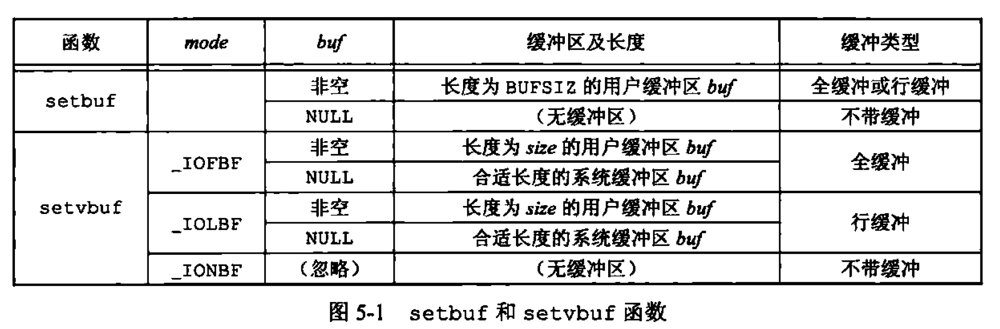

<h1 align="center">📒 第 05 章 标准I/O库 学习笔记</h1>


## 1. 流和FILE对象
所有的I/O函数都是围绕文件描述符进行。当打开一个文件时，即返回一个文件描述符，然后在该文件描述符就用于后续的I/O操作。对于I/O标准库，操作是围绕流进行。

标准I/O文件流可用于单字节或多字节字符集。流的定向决定了所读、写的字符是单字节还是多字节。

两个函数改变流的定向：

- `freopen` ： 清除一个流的定向
- `fwide` ： 设置流的定向。


```c
#include <stdio.h>
#include <wchar.h>

int fwide(FILE *fp, int mode);
```

- 返回值
    - 若流是`宽定向`，返回`正值`。
    - 若流是`字节定向`，返回`负值`。
    - 若流是`未定向`，返回`0`。


- mode 参数
    - 若为`负值`，fwide 将指定的流是字节定向的。
    - 若为`正值`，fwide 将指定的流是宽定向的。
    - 若为`0值`，fwide 不设置流的定向，则返回标识该流定向的值。

`fwide` 无出错定向，如果流是无效，则在调用`fwide`前先清除 `errno`，从`fwide`返回时检查 `errno`的值。

当打开一个流时，标准I/O函数 `fopen` 返回一个指向FILE对象的指针。称指向FILE对象的指针（类型为`FILE*`）为`文件指针`。


## 2. 标准输入、标准输出和标准错误
对一个进程预定义了3个流：
- 标准输入
- 标准输出
- 标准错误

通过预定义头文件指针 `stdin`、`stdout` 和 `stderr` 引用。指针定义在头文件 `<stdio.h>` 中。

## 3. 缓冲
标准I/O库提供缓冲的目的：尽可能减少使用 read 和 write 调用次数。提供了三种类型：

- 全缓冲
    - 在填满标准I/O缓冲区后才进行实际I/O操作。

    - 驻留在磁盘上的文件通常是由标准I/O库实施全缓冲的。通常调用 malloc 获得需要使用的缓冲区。

- 行缓冲
    - 当在输入和输出中遇到换行符时，标准I/O库执行I/O操作。
    - 有两个限制：
        - 标准I/O库用来收集每一行的缓冲区的长度是固定的，只要填满缓冲区，即使没有换行符，也会执行I/O操作。
        - 只要通过I/O库要求从一个不带缓冲的流，或者一个行缓冲的流得到输入数据，则就会flush所有行缓冲输出流。


- 不带缓冲
    - 标准I/O库不对字符进行缓冲存储。
    - 典型：标准错误流 stderr。

ISO C要求缓冲的特征如下：

- 当且仅当标准输入和标准输出并不指向交互式设备时，才是全缓冲。
- 指向终端设备的流时，则是行缓冲。
- 标准错误决不会是全缓冲区，是不带缓冲的。

对于任何一个给定的流，可以使用函数去更改缓冲的类型：

```c
#include <stdio.h>

int setbuf(FILE *restrict fp, char *restrict buf);
int setcbuf(FILE *restrict fp, char *restrict buf, int mode, size_t size);
```

- 函数一定要在流已被打开后调用。也该在对流执行任何一个其他操作之前调用。

- 使用 `setbuf` 打开或关闭缓冲机制。

- 使用 `setvbuf`，设置缓冲类型的`mode 参数`为：
    - `_IOFBF`：全缓冲
    - `_IOLBF`：行缓冲
    - `_IONBF`：不带缓冲

总结：



在分配流之后，需要关闭流，标准I/O就会自动释放缓冲区。

```c
#include <stdio.h>

int fflush(FILE *fp);
```

- 特殊情况：若fp是NULL，则此函数将导致所有输出流被冲洗。


## 4. 打开流
打开标准I/O流的函数：

```c
#include <stdio.h>

FILE *fopen(const char *restrict pathname, const char *restrict type);
FILE *freopen(const char *restrict pathname, const char *restrict type, FILE *restrict fp);
FILE *fdopen(itn fd, const char *type);
```

- 三者区别：
    - `fopen` 打开路径名为 `pathname` 的一个指定的文件。
    - `freopen` 在一个指定的流上打开一个指定的文件。
        - 若流已打开，则先关闭。
        - 若流已定向，则使用 `freopen`清除定向。
    - `fdopen` 去一个已有的文件描述符，并使一个标准I/O流与该描述符相结合。
        - 常用于由创建管道和网络通信通道函数返回的描述符。

当以`读和写`类型打开一个文件时（`type中+`号），有限制：

- 如果中间没有 `fflush`、`fseek`、`fsetpos` 或者 `rewind`，则输出的后面`不能直接跟随输入`。
- 如果中间没有 `fseek`、`fsetpos` 或 `rewind`，或一个输入操作`没有到达文件尾端`，则在输入操作之后不能直接跟随输出。

一旦打开了流，在对流进行任何操作之前，如果想要修改缓冲的类型则使用 `setbuf` 和 `setvbuf` 函数。


当进程正常终止时，则所有带未写缓冲数据的标准I/O流都被冲洗，所有打开的标准I/O流都被关闭。

## 5. 读和写流


### 5.1 输入函数

```c
#include <stdio.h>

int ferror(FILE *fp);
int feof(FILE *fp);

void clearerr(FILE *fp);
```

`getchar` 等同于 `getc(stdin)`，`getc`可实现为宏，而`fgetc`不能实现为宏。

不管是出错还是到达文件尾端，所以调用 `ferror` 或 `feof`。

```c
#include <stdio.h>

int ferror(FILE *fp);
int feof(FILE *fp);

void clearerr(FILE *fp); // 清除标志
```

为每个流在 FILE 对象中维护了两个标志：

- 出错标志
- 文件结束标志

从流中读取数据后，可以调用 ungetc 将字符再压送回流中。

```c
#include <stdio.h>

int ungetc(int c, FILE *fp);
```

### 5.2 输出函数

```c
#include <stdio.h>

int putc(int c, FILE *fp);
int fputc(int c, FILE *fp);
int putchar(int c);
```

`putchar(c)` 等同于 `putc(c, stdout)`。`putc` 可被实现为宏，而 `fputc` 不能实现为宏。


## 6. 每次一行I/O
每次输入一行的函数：

```c
#include <stdio.h>

char *fgets(char *restrict buf, int n, FILE *restrict fp);
char *gets(char *buf);
```

- gets 从标准输入读。
    - 一般不推荐使用。不能指定缓冲区的长度，会造成缓冲区溢出。

- fgets 从指定的流读。
    - 必须指定缓冲的长度n。
    - 读到下一个换行符位置，不超过n-1字符，将读入的字符送入缓冲区（以null结尾）。


每次输出一行的函数：

```c
#include <stdio.h>

int fputs(const char *restrict str, FILE *restrict fp);
int puts(const char *str);
```

- `fputs` 将一个以 `null字符` 终止的字符串写到指定的流，尾端的终止符null不写出。

- `puts` 将一个以 `null字符` 终止的字符串写到标准输出，终止符不写出。
    - 不安全，一般不推荐使用。

## 7. 标准I/O的效率

getc 和 putc 将标准输入复制到标准输出

```c
#include <stdio.h>
#include <stdlib.h>

int main(void)
{
    int c;
    while ((c =getc(stdin)) != EOF) {
        if (putc(c, stdout) == EOF) {
            printf("output error");
        } 
    }

    if (ferror(stdin)) {
        printf("input error");
    }
    exit(0);
}
```

使用 fgets 和 fputs 将标准输入复制到标准输出

```c
#include <stdio.h>
#include <stdlib.h>

#define MAXLINE 4096

int main(void)
{
    char buf[MAXLINE];
    while (fgets(buf, MAXLINE, stdin) != NULL) {
        if (fputs(buf, stdout) == EOF) {
            printf("output error");
        } 
    }
    if (ferror(stdin)) {
        printf("input error");
    }
    exit(0);
}
```

以上两个程序，都没有显式地关闭标准I/O流，但exit函数回flush任何未写的数据，然后关闭所有打开的流。

对于程序的效率来说，系统调用比普通的函数调用的时间
要长。而时间依赖于不同的系统、实现等。对于大多数复杂的应用程序来说，最主要的用户CPU时间是由应用本身的各种处理消耗的，而不是由标准I/O例程消耗的。

 
## 8. 二进制I/O

```c
#include <stdio.h>

// 二者返回读或写的对象数
size_t fread(void *restrict ptr, size_t size, size_t nobj, FILE *restrict fp);
size_t fwrite(const void restrict ptr, size_t size, size_t nobj, FILE *restrict fp);
```

常见的两种用法：

- 读或写一个二进制数组。


    ```c
    float data[10];
    // size 为每个数组元素的长度，nobj 为想要写的元素个数
    if (fwrite(&data[2], sizeof(float), 4, fp) != 4) {
        printf("fwrite error");
    }
    ```

- 读或写一个结构。

    ```c
    struct {
        short count;
        long total;
        char name[NAMESIZE];
    }item;
    // 指定size 为结构的长度，nobj为1,（要写的对象个数）
    if (fwrite(&item, sizeof(item), 1, fp) != 1) {
        printf("fwrite error");
    }
    ```

使用二进制I/O的局限性：只能用于读在同一个系统上已写的数据。原因：

- 在一个结构中，同一成员的偏移量可能会随着编译程序和系统的不同而不同（典型：对齐要求）。

- 用来存储多字节整数和浮点值的二进制格式在不同的系统结构间也可能不同。


## 9. 定位流
定位标准I/O流的3种方法：

- `ftell` 和 `fseek`

    ```c
    #include <stdio.h>

    long ftell(FILE *fp); // 成功返回当前文件位置指示，失败则返回-1
    int fseek(FILE *fp, long offset, int whence);

    void rewind(FILE *fp); // 将一个流直接设置到文件的起始位置
    ```

    - 对于 `whence` 的值和lseek的一致：

        - `SEEK_SET`：从文件的起始位置开始。
        - `SEEK_CUR`：从当前文件位置开始。
        - `SEEK_END`：从文件的尾端开始。

    - 对于`文本文件`，在不同的系统中可能不同的格式存放。所以定位文本文件时，whence一定要是`SEEK_SET`，`offset`只有两个值：`0（后退到文件的起始位置）` 或 `该文件的ftell 返回的值`。


- `ftello` 和 `fseeko`

    ```c
    #include <sdtio.h>

    off_t ftello(FILE *fp); //成功返回当前文件位置，失败返回 (off_t) - 1
    int fseeko(FILE *fp, off_t offset, int whence); // off_t 类型定义为长于32位
    ```

- `fgetpos` 和 `fsetpos`

    ```c
    #include <stdio.h>
    // fgetpos 将文件位置指示器的当前值存入由pos指向的对象中。
    
    int fgetpos(FILE *restrict fp. fpos_t *restrict pos);
    int fsetpos(FILE *fp, const fpos_t (pos));
    ```

    - fgetpos 将文件位置指示器的当前值存入由 pos 指向的对象中。在使用 fsetpos是，可以使用此值将流重新定位到该为止。


## 10. 格式化I/O


### 10.1 格式化输出

```c
#include <stdio.h>

// 成功返回输出字符数，出错返回负值
int printf(const char *restrict format, ...);
int fprintf(FILE *restrict fp, const char *restrict format, ...);
int dprintf(int fd, const char *restrict format, ...);

int sprintf(char *restrict buf, const char *restrict format, ...); // 成功返回存入数组的字符数，编码出错，则返回负值
int snprintf(char *restrict buf, size_t n, const char *restrict format, ...); // 若缓冲区足够大，则返回将要存入数组的字符数，若编码出错，返回负值
```

- printf 将格式化数据写到标准输出。
- fprintf 写到指定的流
- dprintf 写到指定的文件描述符
- sprintf 将格式化的字符送入数组buf中，会在数组尾端自动加上null，但不包括在返回值中。
    - 会造成buf缓冲区溢出。

对于格式说明控制符，用来表示如何显示，以%开始。转换说明一般由4个可选择的部分：

```c
%[flags][fldwidth][precision][lenmodifier]convtype
```

- fldwidth：说明最小字段宽度
- precision：说明整型转换后最少输出数字位数、浮点数转换小数点后的最少位数、字符串转换后最大字节数。
- lenmodifier：长度修饰符。如L表示long double类型。
- convtype：不可选，控制如何解释参数。

对于 printf 的结构变体：

```c
#include <stdio.h>
#include <stdarg.h>

// 所有3个函数返回值：成功返回字符数，失败则返回负值
int vprintf(const char *restrict format, va_list arg);
int vfprintf(FILE *restrict fp, const char *restrict format, va_list arg);
int vdprintf(int fd, const char *restrict format, va_list arg);

int vsprintf(char *restrict buf, const char *restrict format, va_list arg); // 成功返回存入数组的字符数，失败则返回负值
int vsnprintf(char *restrict buf, size_t n, const char *restrict format, va_list arg);
```

### 10.2 格式化输入

```c
#include <stdio.h>

int scanf(const char *restrict format, ...);
int fscanf(FILE *restrict fp, const char *restrict format, ...);
int sscanf(const char *restrict buf, const char *restrict format, ...);
```

- scanf族用于分析输入字符串，并将字符序列转换为指定类型的变量。

格式说明控制如何转换参数，以便于赋值。以 % 开始，分为3部分：

```c
%[*][fldwidth][m][lenmodifier]convtype
```

- `*` 用于强制转换。
- `fldwidth` 说明最大宽度（即最大字符数）。
- `lenmodifier` 说明要用转换结果赋值的参数大小。
- `m` 是`赋值分配符`，用于`%c`、`%s`以及`%[转换符]`，使得内存缓冲区分配空间以接纳转换字符串。

几个 scanf 的变体：

```c
#include <stdarg.h>
#include <stdio.h>

int vscanf(const char *restrict format, va_list arg);
int vfscanf(FILE *restrict fp, const char *restrict format, va_list arg);
int vsscanf(const char *restrict buf, const char *restrict format, va_list arg);
```

- 返回值：
    - 成功，返回指定的输入项目数
    - 若输入错误或者任一转换前文件结束，返回EOF


## 11. 实现细节

每个标准I/O流都有一个与其相关联的文件描述符，可以对一个流调用fileno函数以获得其描述符。

```c
#include <stdio.h>

int fileno(FILE *fp); // 返回与该流相关联的文件描述符
```

对各个标准I/O流打印缓冲状态信息：[03.print_buffer_status_info_for_IO.c](./src/03.print_buffer_status_info_for_IO.c)

程序会出现报错，解决方案信息说明：


## 12. 临时文件
ISO C标准I/O库提供创建临时文件的两个函数：

```c
#include <stdio.h>

char *tmpnam(char *ptr); // 返回值：指向唯一路径名的指针
FILE *tmpfile(void); // 成功，返回文件指针，失败，则返回NULL
```

- 如果 `ptr` 是 `NULL`，则产生的路径名存放在一个静态区中，指向该静态区的指针作为函数值返回。后续调用 tmpnam 会`重写`该区域。

- 如果不是 `NULL`，则指向长度至少是 `L_tmpnam` 个字符的数组。

- tmpfile 创建一个临时二进制文件。在关闭文件或者程序结束时会自动删除文件。

```c
#include <stdio.h>
#include <stdlib.h>

#define MAXLINE 4096

int main(void)
{
    char name[L_tmpnam], line[MAXLINE];
    FILE *fp;

    printf("%s\n", tmpnam(NULL)); // first temp file

    tmpnam(name); // second temp file
    printf("%s\n", name);

    if ((fp = tmpfile()) == NULL) { // create temp file
        printf("tmpfile error");
    }

    fputs("one line of output\n", fp); // write to temp file
    rewind(fp); // then read it back

    if (fgets(line, sizeof(line), fp) == NULL) {
        printf("fgets error");
    }

    fputs(line, stdout); // print the line we wrote

    exit(0);
}
```

在最新的gcc的内核和gcc版本时，会报错：

```shell
04.test_tmpnam_and_tmpfile_function.c:(.text+0x2d): warning: the use of `tmpnam' is dangerous, better use `mkstemp'
```

SUS（Single UNIX Specification）提供了两个函数(是XSI的扩展)：

```c
#include <stdlib.h>

// template 确定名，字符串的后6位设置为xxxxxx 的路径名。

char *mkdtemp(char *template); // 成功返回指向目录名的指针，失败则返回NULL

int mkstemp(char *template); // 成功返回文件描述符，出错返回-1。
```

- mkdtemp 创建目录，目录有唯一的名字。
    - 使用的访问权限位：`S_IRUSR | S_IWUSR | S_IXUSR`。

- mkstemp 创建文件，文件有唯一的名字。
    - 使用访问权限位：`S_IRUSR | S_IWUSR`。


- 注意：mkstemp 创建的临时文件 ~~`不会自动删除`~~ ，如果需要删除，则需要先`解除链接（unlink）`。


```c
#include <stdio.h>
#include <stdlib.h>
#include <errno.h>
#include <unistd.h>
#include <sys/stat.h>

void make_temp(char *template);

int main()
{
    char good_template[] = "/tmp/dirXXXXXX"; // right way
    char *bad_template = "/tmp/dirXXXXXX"; // wrong way

    printf("trying to create first temp file ...\n");
    make_temp(good_template);

    printf("trying to create second temp file ...\n");
    make_temp(bad_template);

    exit(0);
}

void make_temp(char *template)
{
    int fd;
    struct stat sbuf;

    if ((fd = mkstemp(template)) < 0) {
        printf("can't create temp file");
    }
    printf("temp name = %s\n", template);
    close(fd);

    if (stat(template, &sbuf) < 0) {
        if (errno == ENOENT) {
            printf("file doesn't exist\n");
        } else {
            printf("stat failed");
        }
    } else {
        printf("file exists\n");
        unlink(template);
    }
}
```

- 数组的名字在栈上分配，而指针的是自身驻留在栈上，编译器将字符串存放在可执行文件的只读段，所以当 `mkstemp` 试图修改字符串时，就会出现 segment fault。


## 13. 内存流

所有的I/O都是通过缓冲区与主存之间来回传送字节来完成。对于内存流的创建，由三个函数：`fmemopen`、`open_memstream` 和 `open_wmemstream`。

```c
#include <stdio.h>
// 成功，返回流指针，失败返回NULL

FILE *fmemopen(void *restrict buf, size_t size, const char *restrict type);

FILE *open_memstream(char **bufp, size_t *sizep);

#include <wchar.h>
FILE *open_wmemstream(wchar_t **bufp, size_t *sizep);
```

- fmemopen 函数允许调用者提供缓冲区用于内存流
    - buf：指向缓冲区的开始位置
        - 为空，函数分配size字节数的缓冲区。流关闭时，缓冲区也会被释放。

    - size：指定缓冲区大小的字节数。
    - type：主要是`r`、`w`、`a`、`b` 和 `+` 几个符号类型的组合使用。


在已知模式填充缓冲区时流写入的操作：[06.memory_stream_write_operation.c](./src/06.memory_stream_write_operation.c)

```c
#include <stdio.h>
#include <string.h>

#define BSZ 48

int main()
{
    FILE *fp;
    char buf[BSZ];

    memset(buf, 'a', BSZ - 2);
    buf[BSZ - 2] = '\0';
    buf[BSZ - 1] = 'X';

    if ((fp = fmemopen(buf, BSZ, "w+")) == NULL) {
        printf("fmemopen error");
    }

    printf("initial buffer contents: %s\n", buf);
    fprintf(fp, "hello, world");
    printf("before flush : %s\n", buf);
    fflush(fp);
    printf("after flush : %s\n",buf);
    printf("len of string in buf = %ld\n", (long)strlen(buf));

    memset(buf, 'b', BSZ - 2);
    buf[BSZ - 2] = '\0';
    buf[BSZ - 1] = 'X';
    fprintf(fp, "hello, world");
    printf("before fseek : %s\n", buf);
    fseek(fp, 0, SEEK_SET);
    printf("after fseek : %s\n",buf);
    printf("len of string in buf = %ld\n", (long)strlen(buf));

    memset(buf, 'c', BSZ - 2);
    buf[BSZ - 2] = '\0';
    buf[BSZ - 1] = 'X';
    fprintf(fp, "hello, world");
    printf("before fclose : %s\n", buf);
    fclose(fp);
    printf("after fclose : %s\n",buf);
    printf("len of string in buf = %ld\n", (long)strlen(buf));

    return 0;
}
```

对于 open_memstream（面向字节的流） 和 open_wmemstream（面向宽字节的流） 都是面向字节的。和 fmemopen 的区别：

- 创建的流只能写打开。
- 不能指定自己的缓冲区，但可以通过 bufp 和 sizep 访问缓冲区的地址和大小。
- 关闭流后需要自行释放缓冲区
- 对流添加字节会增加缓冲区的大小。

但缓冲区地址和大小遵循规则：

- 缓冲区地址和长度只有在调用 fclose 和 fflush 后才有效。
- 两个值只有在下一次流写入或者调用fclose之前有效。

对于内存流，适合创建字符串。内存流只访问主存，不访问磁盘文件。


## 14. 标准I/O的替代软件
- sfio：与fio相近，快于标准I/O库。

- ASI（Alloc Stream Interface）：使用映射文件 --- mmap 函数。

