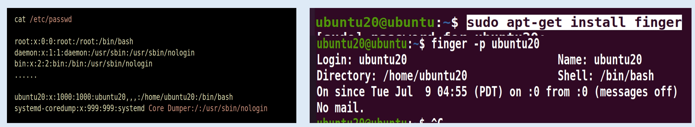
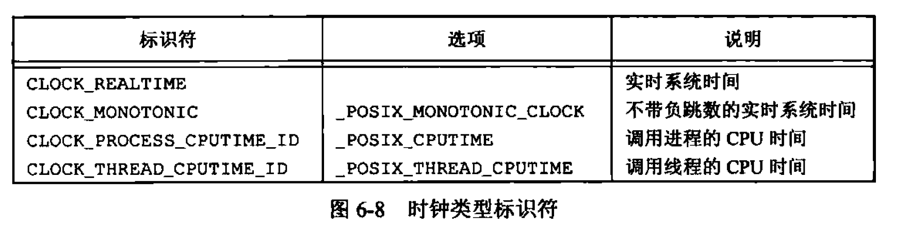
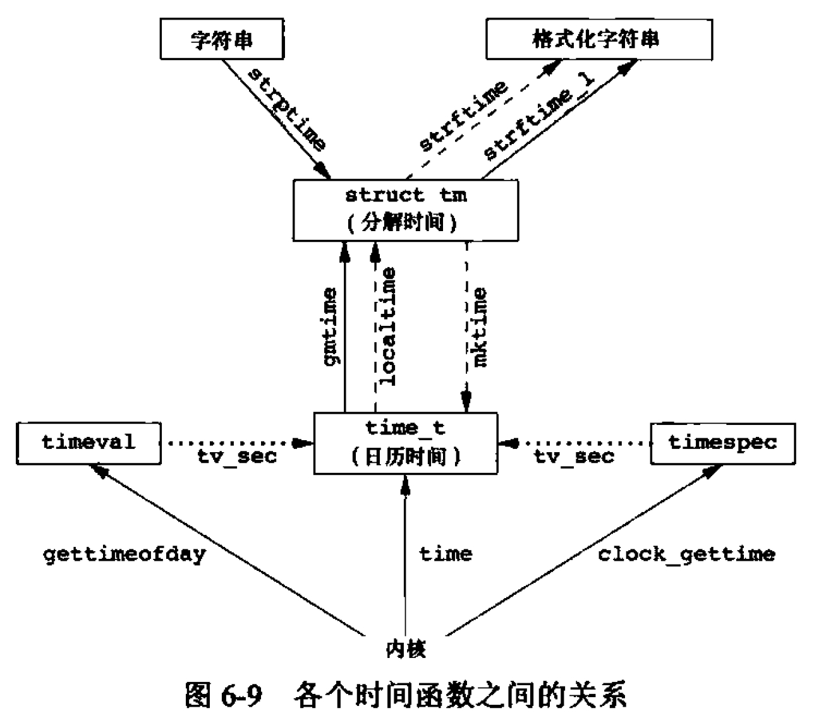

<h1 align="center">📒 第 06 章 系统数据文件和信息 学习笔记</h1>


## 1. 口令文件

UNIX 系统口令文件的passwd结构体字段定义在 `<pwd.h>` 头文件中。

```c
struct passwd{
    char *pw_name; // 用户名
    char *pw_passwd; // 加密口令
    uid_t pw_uid; // 数值用户ID
    gid_t pw_gid; // 数值组ID
    char *pw_gecos; // 注释字段
    char *pw_dir; // 初始工作目录
    char *pw_shell; // 初始shell（用户程序）
    char *pw_class; // 用户访问类
    time_t pw_change; // 下次更改口令时间
    time_t pw_expire; // 用户有效期时间
};
```

在Linux系统，文件信息显示如下：




有的系统提供 vipw 命令，允许管理员修改口令文件。

POSIX.1 定义了两个获取口令文件项的函数：

```c
#include <pwd.h>

struct passwd *getpwuid(uid_t uid); // ls 程序会使用，将i节点中的数字用户ID映射为用户登录名
struct passwd *getpwnam(const char *name);  // login(1) 程序使用，主要是输入登录名时

struct passwd *getpwent(void); // 返回口令文件中的下一个记录项
void setpwent(void);
void endpwent(void);
```

- `passwd` 结构通常是函数内部的静态变量，所以只要调用任一相关函数，内容就会被重写。


getpwnam 函数的一个实现：

```c
#include <pwd.h>
#include <stddef.h>
#include <string.h>

struct passwd *getpwnam(const char *name)
{
    struct passwd *ptr;

    setpwent();

    while ((ptr = getpwent()) != NULL)
    {
        if (strcmp(name, ptr->pw_name) == 0) {
            break;
        }
    }
    endpwent();
    return ptr;
}
```

## 2. 阴影文件
加密口令是经单向加密算法处理过的用户口令副本。单向：从加密口令猜不到原来的口令。

常见的加密算法：MD5、SHA-1。

从安全性的角度考虑，某些系统将加密口令存放在`阴影口令（shadow password）`的文件中。

```c
struct spwd {
    char *sp_namp; // 用户登录名
    char *sp_pwdp; // 加密口令
    int sp_lstchg; // 上次更改口令以来经过的时间
    int sp_min; // 经多少天后允许更改
    int sp_max; // 要求更改尚余天数
    int sp_warn; // 超期警告天数
    int sp_inact; // 账户不活动之前尚余天数
    int sp_expire; // 账户超期天数
    unsigned int sp_flag; // 保留
};
```

对于阴影口令文件，一般用户不能读取。如果没有root用户的程序，只有个别程序可以读取。例如`login(1)` 和 `passwd(1)`。

访问阴影口令文件的几个函数：

```c
#include <shadow.h>

struct spwd *getspnam(const char *name);
struct spwd *getspent(void);

void setspent(void);
void endspent(void);
```

在 FreeBSD 8.0 和 MAC OS X 10.6.8 中，没有阴影口令结构。


## 3. 组文件
group 结构定义在 `<grp.h>` 头文件中。

```c
struct group {
    char *gr_name; // 组名
    char *gr_passwd; // 加密口令
    int gr_gid; // 数值组ID
    char **gr_mem; // 指向各用户名指针的数组， 数组以 null 指针结尾
};
```

查看组名 或者 数值组ID：

```c
#include <grp.h>

struct group *getgrpid(gid_t gid);
struct group *getgrnam(const char *name);
```

搜索整个组文件：

```c
#include <grp.h>

struct group *getgrent(void); // 从组文件中读取下一个记录，如果文件未打开，则先打开

void setgrent(void); // 打开组文件，并反绕
void endgrent(void); // 关闭组文件
```

## 4. 附属组ID
4.2BSD引入附属ID，不仅可以属于口令文件记录项中组ID所对应的组，也可以属于多至16个另外的组。

使用附属组ID的优点：不必显式地经常更改组。

获取和设置附属组ID的几个函数：

```c
#include <unistd.h>

int getgroup(int gidsetsize, gid_t grouplist[]); // 成功，返回附属组ID数量，失败，返回-1

#include <grp.h>
#include <unistd.h>

int setgroups(int ngroups, const gid_t grouplist[]);


#include <grp.h>
#include <unistd.h>
int initgroups(const char *username, gid_t basegid); // 成功返回0，失败则返回-1
```

- getgroups 将进程所属用户的各附属组ID填写到数组grouplist中。大小为 gidsetsize 个。

- setgroups 由超级用户调用以便为调用进程设置附属组ID标。

- initgroups 读整个组文件，对username确定其组的成员关系，然后调用setgroups，为该用户初始化附属组ID标。
    - 只有少数程序会调用，例如 `login(1)`。


## 5. 其它数据文件
UNIX系统会提供很多文件，但是基本上的数据文件接口都会至少有3个函数：

- get 函数：读下一个记录，如果需要则打开文件。

    - 如果要保存get返回的静态存储类结构体，需要保存并复制它。

- set 函数：打开相应数据文件，然后反绕文件。
    - 起始处开始处理时调用函数。

- end 函数：关闭相应数据文件。


## 6. 登录账户记录
大多数UNIX提供提供两种数据文件：

- utmp文件：记录当前登录到系统的各个用户。

- wtmp文件：跟踪各个登录和注销事件。

```c
struct utmp{
    char ut_time[8]; // tty line : ttyd0
    char ut_name[8]; // login name
    long ut_time; // seconds since Epoch
};
```

- 登录时，login 程序填写utmp结构体，并切入utmp文件中，也将其填写到wtmp文件中。
- 注销时，init 进程将utmp文件中的记录擦除，并将一个新记录填写到 wtmp 中。
- 系统再启动时，将更改系统时间和日期的前后，追加到 wtmp 文件中。


## 7. 系统标识
uname 函数：返回与主机和OS有关的信息。

```c
#include <sys/utsname.h>

struct utsname {
    char sysname[ ]; // OS 名字
    char nodename[ ]; // node 名字
    char release[ ]; // OS的当前release
    char version[ ]; // release 的当前版本
    char machine[ ]; // 硬件类型名
};

int uname(struct utsname *name);
```

- 每个字符串都以 `null` 字节结尾。

在BSD派生的系统提供了 gethostname 函数：

```c
#include <unistd.h>

int gethostname(char *name, int namelen);  // 函数一般用在 TCP/IP 网络上主机的名字。
```

- namelen 指定name缓冲区长度。
    - 空间足够：返回以 null 结尾。
    - 空间不足：不一定以 null 结尾。


`hostname(1)` 命令可用来获取和设置主机名。主机名由系统自举时设置，由 `/etc/rc` 或 `init` 取自一个启动文件。


## 8.时间和日期例程
UNIX内核提供的基本时间服务时计算自世界时（UTC）1970年1月1日00:00:00 以来经过的秒数。

time 函数返回当前时间和日期：

```c
#include <time.h>

time_t time(time_t *calptr);
```

对于时钟，通过 `clockid_t` 类型来标识。




`clock_gettime` 用于获取指定时钟的时间。

```c
#include <sys/time.h>
int clock_gettime(clockid_t clock_id, struct timespec *tsp);
```

- 当 clock_id = CLOCK_REALTIME 时，与time函数是同样的功能。但精度比time要高。

```c
#include <sys/time.h>

int clock_getres(clockid_t clock_id, struct timespec *tsp);
```

- `clock_getres` 把参数tsp指向的 `timespec` 结构初始化为与 `clock_id` 参数对应的时钟精度。

对特定的时钟设置时间：

```c
#include <sys/time.h>

int clock_settime(clockid_t clock_id, const struct timespec *tsp);
```

对于多个时间函数之间的关系如下：




localtime 和 gmtime 函数将日历时间转换成分解的时间，并将其存放到 tm 结构体中。

```c
struct tm {
    int tm_sec; // seconds after the minute : [0 - 60]
    int tm_min; // minutes after the hour : [0 - 59]
    int tm_hour; // hours after midnight : [0 - 23]
    int tm_mday; // day of the month: [1 - 31]
    int tm_mon; // months since January : [0 - 11]
    int tm_year; // years since 1900
    int tm_wday; // days since Sunday : [0 - 6]
    int tm_yday; // days since January 1 : [0 - 365]
    int tm_isdst; // daylight saving time flag : < 0, 0, > 0
};

#include <time.h>

struct tm *gmtime(const time_t *calptr);
struct tm *localtime(const time_t *calptr);
```

- `localtime` 将日历时间转换成本地时间。
- `gmtime` 将日历时间转换成协调统一时间的年、月、日、时、分、秒、周日、分解结构。


而对于 `mktime` 将本地时间的年、月、日等作为参数，将其换成 `time_t` 值。

```c
#include <time.h>

time_t mktime(struct tm *tmptr);
```

类似于printf的一个时间值函数：strftime。

```c
#include <time.h>

size_t strftime(char *restrict buf, size_t maxsize, const char *restrict format, const struct tm *restrict tmptr);
size_t strftime_l(char *restrict buf, size_t maxsize, const char *restrict format, const struct tm *restrict tmptr, locale_t locale)
```

- tmptr ：要格式化的时间指定。由一个指向分解时间值 tm结构的指针说明
- maxsize： 将格式化结果存放的buf数组大小
- format：时间值的格式。和 printf 中的%开头。


strftime 函数打印当前日期和时间的字符串：

```c
#include <stdio.h>
#include <stdlib.h>
#include <time.h>

int main(void)
{
    time_t t;
    struct tm *tmp;
    char buf1[16];
    char buf2[64];

    time(&t);
    tmp = localtime(&t);

    if (strftime(buf1, 16, "time and date : %r,  %a %b %d,  %Y", tmp) == 0) {
        printf("buffer length 16 is too small\n");
    } else {
        printf("%s\n", buf1);
    }

    if (strftime(buf2, 64, "time and date : %r,  %a %b %d,  %Y", tmp) == 0) {
        printf("buffer length 64 is to small\n");
    } else {
        printf("%s\n", buf2);
    }

    exit(0);
}
```

`strptime` 将字符串时间转换成分解时间。和 `strftime` 相反。

```c
#include <time.h>

char *strptime(const char *restrict buf, const char *restrict format, struct tm *restrict tmptr);
```


## 9. 习题

1. 如果系统使用阴影文件，那么如何取得加密口令？


2. 假设有超级用户权限，并且系统使用了阴影口令，重新考虑上一题。


3. 编写一程序，调用uname并输出utsname结构中的所有字段，将该输出与 uname(1) 命令的输出结果进行比较。


4. 计算可由 time_t 数据类型表示的最近时间。如果超出了这一时间将会如何？


5. 编写一程序，并使用 strftime 将输出结果转换为类似 date(1) 命令的默认输出。将环境变量TZ设置为不同值，观察输出结果。


