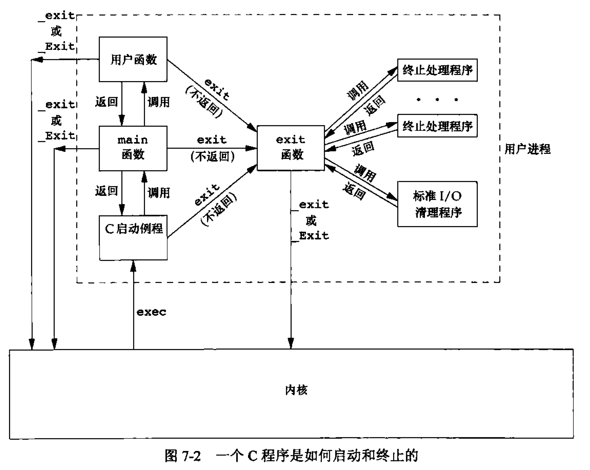
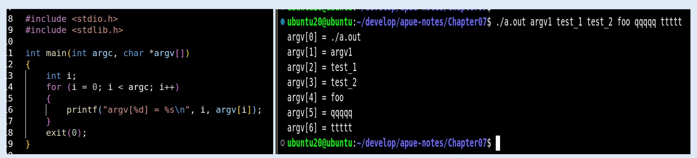
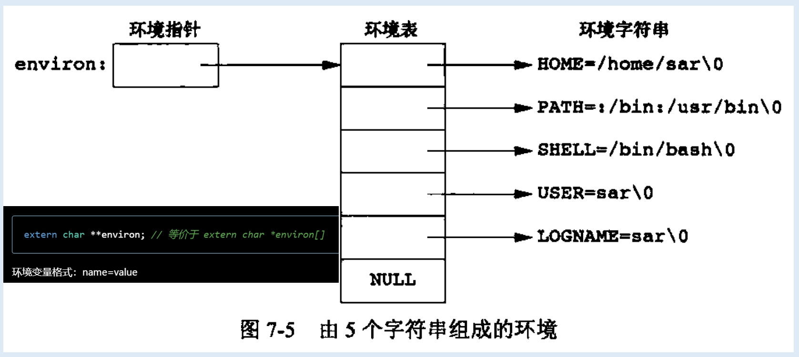
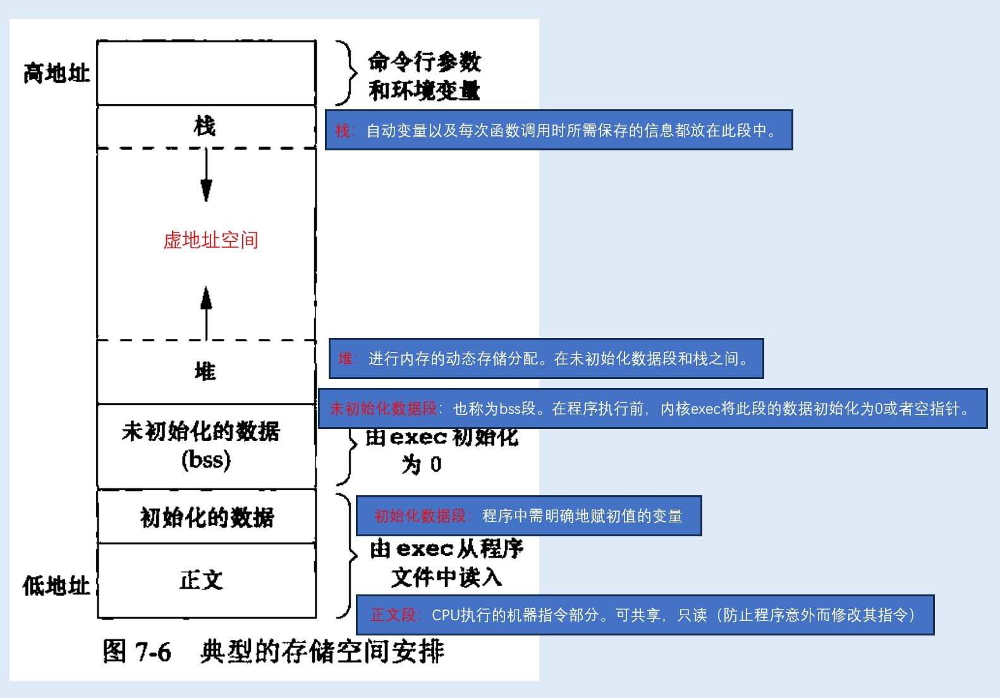

<h1 align="center">📒 第 07 章 进程环境 学习笔记</h1>


## 1. main函数
C程序总是从main函数开始执行。main函数的原型：

```c
int main(int agrc, char *argv[]) {}
```

- argc：命令行参数的数目
- argv 指向参数的各个指针构成的数组。


## 2. 进程终止
进程终止的8种方式：

- 正常终止
    - 从`main`返回
    - 调用`exit`
    - 调用 `_exit` 或 `_Exit`
    - 最后一个线程从其启动例程返回。
    - 从最后一个线程调用 `pthread_exit`。

- 异常终止
    - 调用`abort`。
    - 接收到一个信号。
    - 最后一个线程对取消请求做出响应。


### 2.1 退出函数
3个函数`正常终止`一个程序：

```c
#include <stdlib.h>
void exit(int status);

void _Exit(int status);

#include <unistd.h>

void _exit(int status);
```

- `_exit` 和 `_Exit` 立即进入内核。
- `exit` 则先执行一些清理处理，然后返回内核。

退出函数都带有一个整型参数，称为终止状态（或退出状态）。


main函数返回一个整型值与用该值调用exit等价。

```c
exit(0); // 等价于 return 0;
```

### 2.2 函数 atexit

atexit 登记终止处理程序的次数。

```c
#include <stdlib.h>

int atexit(void (*func)(void));
```

- 参数是`函数地址`，调用调用此函数时，无需传参，也无返回值。

对于 `exit` 来说，先调用各终止处理程序，然后关闭（使用`fclose`）所有打开流。一个完整的C程序的运行流程如下：




注意点：

- 调用 `exec` 是内核使程序执行的唯一方法。
- 调用 `exit`、`_exit` 或 `_Exit` 是进程自愿终止的唯一方法
- 非自愿的方式：信号使其终止。

使用 atexit 函数代码案例：[]()

```c
#include <stdlib.h>
#include <stdio.h>

static void my_exit1(void);
static void my_exit2(void);

int main(void)
{
    if (atexit(my_exit2) != 0) {
        printf("can't register my_exit2");
    }
    if (atexit(my_exit1) != 0) {
        printf("can't register my_exit1");
    }
    if (atexit(my_exit1) != 0) {
        printf("can't register my_exit1");
    }
    printf("main is done\n");
    return 0;
}

static void my_exit1(void)
{
    printf("first exit handler\n");
}

static void my_exit2(void)
{
    printf("second exit handler\n");
}
```

终止程序每登记一次，就会被调用一次。

## 3. 命令行参数

当执行一个程序时，调用exec的进程就会将命令行参数传递给执行程序。



ISO C 和 POSIX.1中 argv[argc] 是空指针时：

```c
for (int i = 0; argv[i] != NULL; i++) {
    // ...
}
```

## 4. 环境表
每个程序都接收一张环境表，是一个`字符指针数组`。每个指针都以 `null` 结束的C字符串的地址。全局变量 environ：




```c
extern char **environ; // 等价于 extern char *environ[]
```
环境变量格式：name=value

通常使用 `getenv` 和 `putenv` 函数来访问特定的环境变量，而不直接使用 `environ` 变量。但如果要查看整个环境变量，则必须使用 enriron指针。

对于旧UNIX版本中，main 有第三个参数：环境表地址。但新标准迭代已不推荐使用。

```c
int main(int argc, char *argv[], char *envp[])
```

## 5. C程序的存储空间布局



size(1) 命令报告正文段、数据段和bss的长度（以字节为单位）

```shell
ubuntu20@ubuntu:~$ size /usr/bin/cc /bin/sh
   text	   data	    bss	    dec	    hex	filename
1133787	  15176	  15176	1164139	 11c36b	/usr/bin/cc
 114971	   4856	  11312	 131139	  20043	/bin/sh
```


## 6. 共享库
共享库的优势：

- 可执行文件不再需要包含公用的函数，而只需在所有进程可引用的存储区中保存库的一个副本。
- 程序第一次执行或者调用某个库函数时，通过动态链接方法将程序与共享库函数链接。
    - 减少可执行文件的长度，增加一些运行时间开销。

- 使用库函数的新版本替代老版本，而无需对使用该库的程序重新链接。


## 7. 存储空间分配
ISO C 中用于存储空间动态分配的3个函数：

```c
#include <stdlib.h>

void *malloc(size_t size);
void *calloc(size_t mobj, size_t size);
void *realloc(void *ptr, size_t newsize);
```

- malloc：分配指定字节数的存储区
    - 存储区中的初始值不确定。

- calloc：为指定数量指定长度的对象分配存储空间。
    - 空间中的每一位都初始化为0。

- realloc：增加或减少以前分配区的长度。
    - 增加时，需要将以前分配的内容移到足够大的区域，便于在尾端增加存储区。
    - 新增区域的初始值不确定。

free函数释放ptr指向的存储空间。被释放的空间被送入可用存储区。

对于malloc和free有几个注意点：

- 释放一个已释放的块，调用free时所用的指针不是3个alloc函数的返回值。
- 一个进程调用malloc后，若忘记调用free，则进程占用的空间会连续增加，从而造成泄露。
- 若不调用free释放不再使用的空间，则进程地址空间的长度会增加，直到无空闲空间。
    - 过度的换页操作，会造成性能下降。


一些替代的存储空间分配函数的库和程序：

- libmalloc
    - SVR4 的UNIX系统提供的库。

- vmalloc

- quick-fit

- jemalloc
    - FreeBSD 8.0 提供的库函数。
    - 多用于多处理器系统中使用多线程的应用程序。

- TCMalloc

- 函数 alloca
    - 优点：当函数返回时，自动释放它所使用的栈帧。
    - 缺点：alloca会增加栈帧的长度。


## 8. 环境变量

ISO C定义了几个函数，可以进行获取、设置、改变、增加环境变量的操作。


```c
#include <stdlib.h>

char *getenv(const char *name); // 返回一个指针，指向 name=value 字符串中的value，如果没找到，则直接返回NULL。
int putenv(char *str);

int setenv(const char *name, const char *value, int rewrite);
int unsetenv(const char *name);
```

- `getenv`：可以获取环境变量值，不直接访问 environ。
- `putenv`：取形式为 name=value的字符串，将其放入环境表中。如果name已存在，则先删除其原来的定义。

- `setenv`：将name 设置为 value，如果name已存在，则：
    - rewrite非0，输出其现有的定义。
    - rewrite为0，则不删除其现有定义。

- `unsetenv`：删除name的定义。


注意点：

- setenv必须分配存储空间，便于参数创建name=value字符串。
- putenv直接将参数字符串传递给环境表中。

## 9. 函数 `setjmp` 和 `longjmp`
C语言中，goto语句不能跨越函数。而指向跳转的函数时 `setjmp` 和 `longjmp`。

```c
#include <setjmp.h>

int setjmp(jmp_buf env);
void longjmp(jmp_buf env, int val);
```

## 10. 函数 `getrlimit` 和 `setrlimit`
每一个进程都有一组资源限制。所以可以使用函数进行查询和更改。

```c
#include <sys/resource.h>

struct rlimit {
    rlim_t rlim_cur; // soft limit : current limit
    rlim_t rlim_max; // hard limit : maxium value for rlim_cur
};

int getrlimit(int resource, struct rlimit *rlptr);
int setrlimit(int resource, const struct rlimit *rlptr);
```

更改资源限制时，遵循3条规则：

- 任何一个进程都可以将一个软限制值更改为小于或等于其硬限制值。
- 任何一个进程都可以降低其硬限制值，但它必须大于或等于其软限制值。降低对普通用户不可逆。
- 只有超级用户进程可以提高硬限制值。

打印当前资源限制：[03.print_current_resource_limit_value.c](./src/03.print_current_resource_limit_value.c)

```c
#include <stdio.h>
#include <stdlib.h>
#include <sys/resource.h>

#define doit(name) pr_limits(#name, name)

static void pr_limits(char *, int);

int main(void)
{
#ifdef RLIMIT_AS
    doit(RLIMIT_AS);
#endif
    doit(RLIMIT_CORE);
    doit(RLIMIT_CPU);
    doit(RLIMIT_DATA);
    doit(RLIMIT_FSIZE);

#ifdef RLIMIT_MEMLOCK
    doit(RLIMIT_MEMLOCK);
#endif

#ifdef RLIMIT_MSGQUEUE
    doit(RLIMIT_MSGQUEUE);
#endif


#ifdef RLIMIT_NICE
    doit(RLIMIT_NICE);
#endif


#ifdef RLIMIT_CORE
    doit(RLIMIT_CORE);
#endif

    doit(RLIMIT_NOFILE);

#ifdef RLIMIT_NPROC
    doit(RLIMIT_NPROC);
#endif


#ifdef RLIMIT_NPTS
    doit(RLIMIT_NPTS);
#endif

#ifdef RLIMIT_RSS
    doit(RLIMIT_RSS);
#endif


#ifdef RLIMIT_SIGPENDING
    doit(RLIMIT_SIGPENDING);
#endif

    doit(RLIMIT_STACK);

#ifdef RLIMIT_SWAP
    doit(RLIMIT_SWAP);
#endif

#ifdef RLIMIT_VMEM
    doit(RLIMIT_VMEM);
#endif

    exit(0);
}

static void pr_limits(char *name, int resource)
{
    struct rlimit limit;
    unsigned long long lim;

    if (getrlimit(resource, &limit) < 0) {
        printf("getrlimit error for %s\n", name);
    }
    printf("%-14s  ", name);

    if (limit.rlim_cur == RLIM_INFINITY) {
        printf("(infinite)  ");
    } else {
        lim = limit.rlim_cur;
        printf("%10lld", lim);
    }

    if (limit.rlim_max == RLIM_INFINITY) {
        printf("(infinite)");
    } else {
        lim = limit.rlim_max;
        printf("%10lld", lim);
    }
    putchar((int)'\n');
}

```


## 11. 习题


1. 在Intel x86 系统上，使用Linux，如果执行一个输出 “hello, world” 的程序但不调用exit或者 return，则程序的返回代码为13（用shell检查），解释其原因。


2. 对于如下代码中的printf函数的结果何时才被真正输出？


3. 是否有方法不适用(1) 参数传递、(b) 全局变量着两种方法，将main中的参数argc和argv传递给它所调用的其他函数？


4. 在有些UNIX系统实现中执行程序时访问不到其数据段的0单元，这是一种有意的安排，为什么？


5. 用C语言的 typedef 为终止处理程序定义了一个新的数据类型 Exitfunc，使用该类型修改 atexit 的原型。

6. 如果使用 calloc分配一个long型的数组，数组的初始值是否为0？如果用calloc分配一个指针数组，数组的初始值是否为空指针？


7. 在 size 命令的输出结果中，为什么没有给出堆和栈的大小？


