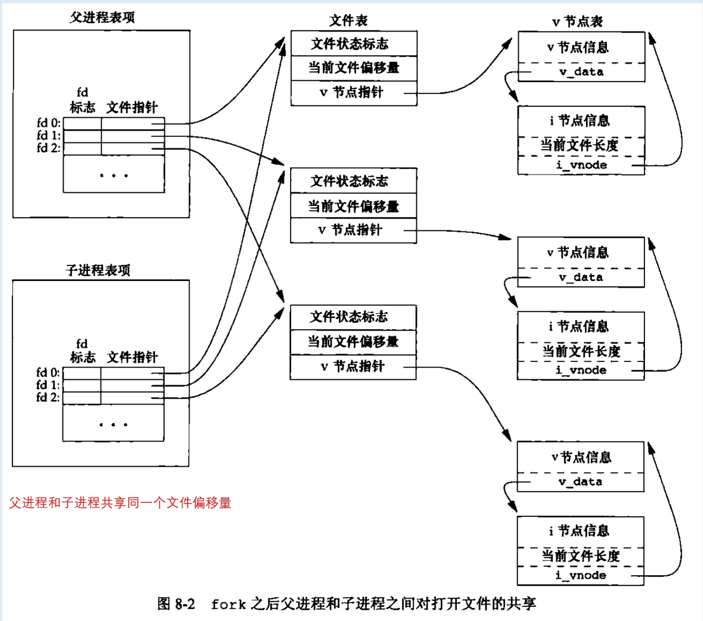
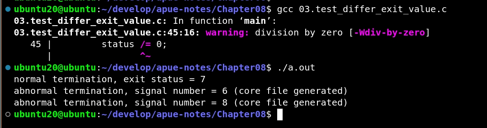
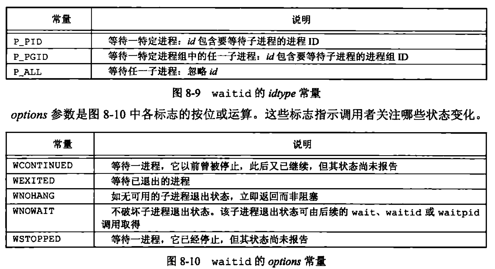
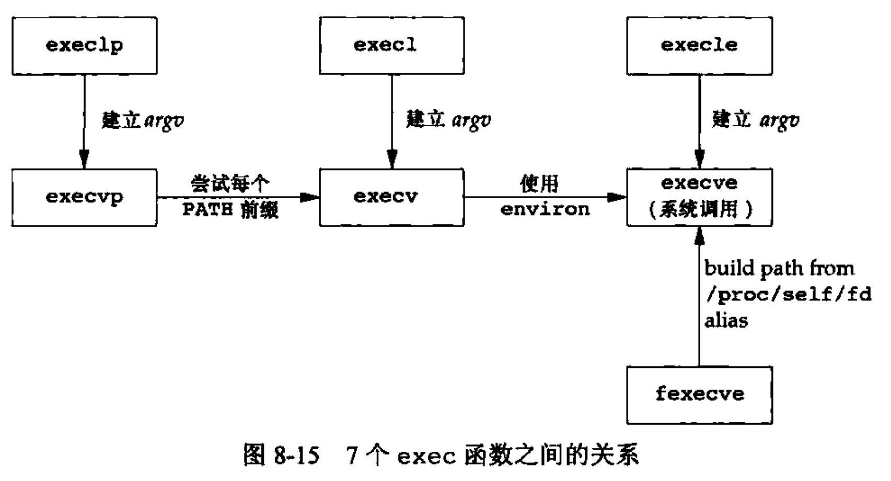
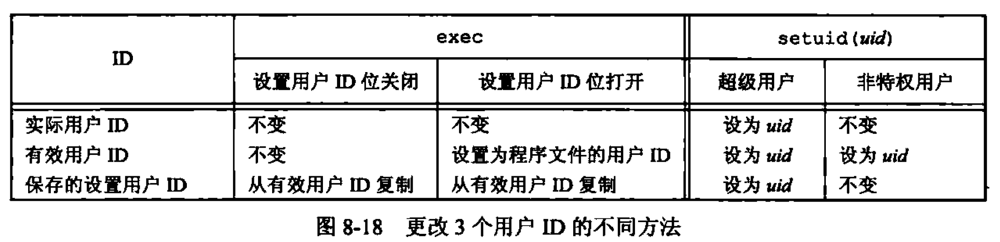
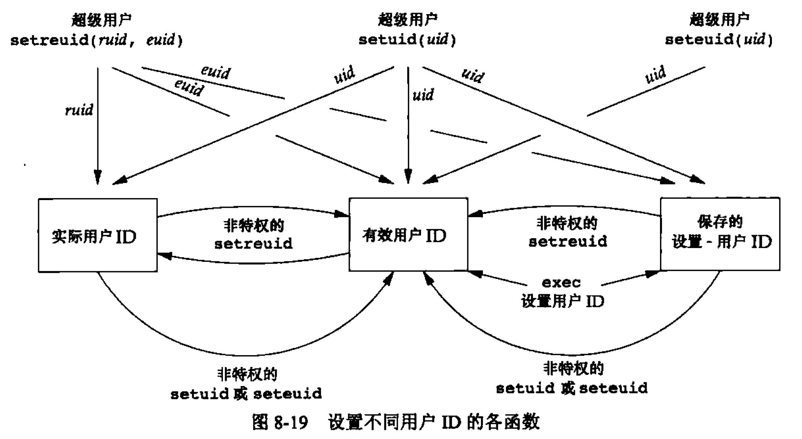

<h1 align="center">📒 第 08 章 进程控制 学习笔记</h1>


## 1. 进程标识
每个进程都有一个非负整型表示的唯一进程ID。ID总是唯一的，将其作为其他标识符的一部分以保证其唯一性。但ID是可复用的。

系统中的专用进程：

- 进程0：调度进程，常被称为交换进程。是内核一部分，不执行任何磁盘上的程序。

- 进程1：通常是init进程，在自举过程结束时由内核调用。

    - 在 /sbin/init 文件中。
    - init进程绝不会终止，是一个普通的用户进程，但它以超级用户特权运行。

返回的一些特定的标识符的函数：

```c
#include <unistd.h>
pid_t getpid(void); // 返回值：调用进程的进程ID

pid_t getppid(void); // 返回值：调用进程的父进程ID

uid_t getuid(void); // 返回值：调用进程的实际用户ID

uid_t geteuid(void); // 返回值：调用进程的有效用户ID

gid_t getgid(void); // 返回值：调用进程的实际组ID

gid_t getegid(void); // 返回值：调用进程的有效组ID
``` 

注意：函数都没有出错返回。


## 2. 函数 fork
由 fork 创建的新进程称为子进程。

```c
#include <unistd.h>

pid_t fork(void); // 返回值：子进程返回0，父进程返回子进程ID，出错返回-1
```

- fork被调用一次，但会返回两次。返回的区别
    - 子进程的返回值是0。原因：
        - 一个进程只有一个父进程，子进程总是可以调用 getppid 以获得其父进程的进程ID。

    - 父进程的返回值则是新建子进程的进程ID。原因：
        - 一个进程的子进程可以有多个，并没有一个函数使一个进程可以获得其所有子进程的进程ID。

测试 fork 函数：

```c
#include <stdio.h>
#include <stdlib.h>
#include <unistd.h>
#include <sched.h>

int globvar = 6;
char buf[] = "a write to stdout\n";


int main(void)
{
    int var;
    pid_t pid;

    var = 18;
    if (write(STDOUT_FILENO, buf, sizeof(buf) - 1) != sizeof(buf) - 1) {
        printf("write error\n");
    }

    printf("before fork\n");

    if ((pid = fork()) < 0) {
        printf("fork error");
    } else if (pid == 0) { // 子进程
        globvar++; // 修改变量
        var++;
    } else {
        sleep(2); // 父进程
    }

    printf("pid = %ld, glob = %d, var = %d\n", (long)getpid(), globvar, var);
    exit(0);
}
```
- 在重定向父进程的标准输出时，子进程的标准输出也会被重定向。

- fork的特性：父进程的所有打开文件描述符都被复制到子进程中。


对于一个进程具有3个不同（标准输入、标准输出和标准错误）的打开文件，所以从fork返回后：



当父进程等待子进程时，子进程写到标准输出，而在自进程终止后，父进程也写到标准输出上，并且知道其输出会追加在自进程所写数据之后。所以父进程和子进程则共享同一文件偏移量。

在fork后处理文件描述符时会有两种情况：

- 父进程等待子进程完成。
    - 父进程无需对其描述符做任何处理。
    - 当子进程终止后，它曾进行过读、写操作的任一共享描述符的文件偏移量已做相应更新。

- 父进程和子进程各自执行不同的程序段。
    - 在fork后，父进程和子进程各自关闭其无需使用的文件描述符，防止去干扰对方使用的文件描述符。
    - 网络服务进程中经常使用。

打开文件之外，父进程的其他属性由子进程继承。包括：

- 实际用户ID、实际组ID、有效用户ID、有效组ID
- 附属组ID
- 进程组ID
- 会话ID
- 控制终端
- 设置用户ID标志和设置组ID标志
- 当前工作目录
- 根目录
- 文件模式创建屏蔽字
- 信号屏蔽和安排
- ......

父进程和子进之间的区别：

- fork 的返回值不同
- 进程ID不同
- 两个进程的父进程ID不同：
    - 子进程的父进程ID是创建它的进程ID
    - 父进程的父进程ID则不变。

- 子进程的 `tms_utime`、`tms_stime`、`tms_cutime` 和 `tms_ustime` 的值设置为0。
- 子进程不继承父进程设置的文件锁。
- 子进程的未处理闹钟被清除
- 子进程的未处理信号集设置为空集。

对于 fork 失败，有两个主要原因：

- 系统中已经有太多的进程
- 实际用户ID的进程总数超过了系统限制。

fork的两种用法：

- 一个进程希望复制自己，使父进程和子进程同时执行不同的代码段

- 一个进程要执行一个不同的程序。
    - 子进程从fork返回后立即调用exec，这个组合操作称为 spawn。

## 3. 函数 vfork
vfork的调用序列和返回值与fork相同，但语义不同。

vfork用于创建一个新进程，目的是exec一个新程序。

对于 fork 和 vfork 区别：

- 都是创建一个子进程，但vfork不会将父进程的地址空间完全复制到子进程中，因子进程会立即调用 exec，所以不会直接引用该地址空间。


- vfork 保证子进程先运行，在调用 exec 或 exit之后，父进程才可能被调度运行，当子进程调用其中之一的函数时，父进程会恢复运行。

    - 如果在调用两个函数之前子进程依赖于父进程的进一步动作，会导致死锁。

```c
#include <stdio.h>
#include <stdlib.h>
#include <unistd.h>
#include <sched.h>

int globvar = 6;

int main(void)
{
    int var;
    pid_t pid;

    var = 88;
    printf("before vfork\n");

    if ((pid = vfork()) < 0) {
        printf("vfork error");
    } else if (pid == 0) { // 子进程
        globvar++; // 修改父进程的变量
        var++;
        _exit(0); // 子进程终止
    }

    printf("pid = %ld, glob = %d, var = %d\n", (long)getpid(), globvar, var);
    exit(0);
}
```

- `_exit` 不执行标准I/O缓冲区的冲洗操作。
- `exit` 会导致的输出不确定，依赖于标准I/O库的实现。


## 4. 函数`exit`

5 种正常终止方式：

- 在`main`函数内执行`return`语句。

- 调用 `exit` 函数。由ISO C定义，其操作包括了调用各终止处理程序，然后关闭所有标准I/O流。

- 调用 `_exit` 或 `_Exit` 函数。
    - ISO C定义。
    - 目的：为进程提供一种无需运行终止处理程序或信号处理程序而终止的方法。

- 进程的最后一个线程在启动例程中执行return语句。

- 进程的最后一个线程调用 pthread_exit 函数。

3 种异常终止方式：

- 调用 abort
- 当进程接收到某些信号时。

- 最后一个线程对 “取消” 请求作出响应。

    - 默认情况下，“取消” 以延迟方式发生：一个线程要求取消另一个线程，若干时间之后，目标线程终止。

对于异常终止的情况，内核会产生一个指示其异常终止原因的终止状态。在任意一种情况下，该终止进程的父进程都能用 `wait` 或 `waitpid` 函数取得其终止状态。

如果父进程在子进程之前终止，结果如何？？

- 对于父进程已终止的所有进程，它们的父进程都改变为init进程。称为被init进程收养。从而保证每个进程都有一个父进程。

如果子进程在父进程之前终止，父进程如何能在做相应检查时得到子进程的终止状态？

- 内核为每个终止子进程保存了信息，使用 `wait` 或者 `waitpid` 可以获取到。


**`僵尸进程`**：一个已终止、但其父进程尚未对其进行善后处理（如释放占用的资源）的进程。

如果由init进程收养的进程终止时会发生什么？

- 不会变成僵尸进程。
    - init只要有一个子进程终止，init就会调用一个 init 函数取得其终止状态。


## 5. 函数`wait` 和 `waitpid`
当一个进程正常或者异常终止时，内核向其父进程发送 `SIGCHLD` 信号。

    - 子进程终止是异步事件，所以信号也是内核向父进程发的异步通知。

调用 `wait` 或 `waitpid` 的进程时：

- 如果其所有子进程都还在运行，则阻塞。
- 如果一个子进程已终止，正等待父进程获取其终止状态，则取得该子进程的终止状态立即返回。
- 如果没有任何子进程，则立即出错返回。

```c
#include <sys/wait.h>

pid_t wait(int *statloc);

pid_t waitpid(pid_t pid, int *statloc, int options);
```

- 函数的区别：

    - 在一个子进程终止前，wait 使其调用者阻塞，而waitpid有选项可以让调用者不阻塞。

    - waitpid 并不等待在其调用之后的第一个终止子进程，它有若干选择，可以控制等待的进程。


如果子进程已终止，且是一个僵死进程，则wait立即返回并取得该子进程的状态，否则wait使其调用者阻塞。

测试不同的exit值：[03.test_differ_exit_value.c](./src/03.test_differ_exit_value.c)

```c
#include <stdio.h>
#include <unistd.h>
#include <sys/wait.h>
#include <stdlib.h>


void print_exit(int status);

int main(void)
{
    pid_t pid;
    int status;

    if ((pid = fork()) < 0) {
        printf("fork error\n");
    } else if (pid == 0) { // child
        exit(7);
    }

    if (wait(&status) != pid) {
        printf("wait error");
    }
    print_exit(status);

    if ((pid = fork()) < 0) {
        printf("fork error");
    } else if (pid == 0) {
        abort();
    }
    if (wait(&status) != pid) {
        printf("wait error");
    }
    print_exit(status);

    if ((pid = fork()) < 0) {
        printf("fork error");
    } else if (pid == 0) {
        status /= 0;
    }
    if (wait(&status) != pid) {
        printf("wait error");
    }
    print_exit(status);

    exit(0);
}

void print_exit(int status)
{
    if (WIFEXITED(status)) {
        printf("normal termination, exit status = %d\n", WEXITSTATUS(status));
    } else if (WIFSIGNALED(status)) {
        printf("abnormal termination, signal number = %d%s\n", WTERMSIG(status),
        #ifdef WCOREDUMP
            WCOREDUMP(status) ? " (core file generated)" : "");
        #else
            "");
        #endif
    } else if (WIFSTOPPED(status)) {
        printf("child stopped, signal number = %d\n", WSTOPSIG(status));
    }
}
```

打印的信息如下：




waitpid 函数可以等待某一个特定的进程。对于pid的参数的解释说明：

- `pid == 1`
    - 等待任一子进程。waitpid 和 wait 同功能。

- `pid > 0`
    - 等待进程ID与pid相等的子进程。

- `pid == 0`
    - 等待组ID等于调用进程组ID的任一子进程。

- `pid < -1`
    - 等待组ID等于pid绝对值的任一子进程。

waitpid返回终止子进程的ID，将子进程的终止状态村存在static指向的存储单元中。


waitpid提供了三个wait没有的三个功能：

- waitpid可等待特定的进程，而wait则返回任一终止子进程的状态。

- waitpid可获取一个子进程的状态，但不想被阻塞。

- waitpid 通过WUNTRACED 和 WCONTINUED 选项支持作业控制。


如果一个进程fork一个子进程，不等待子进程终止，但也不希望子进程处于僵死状态直到父进程终止。

```c
#include <sys/wait.h>
#include <stdio.h>
#include <stdlib.h>
#include <unistd.h>

int main(void)
{
    pid_t pid;

    if ((pid = fork()) == 0) {
        printf("fork error\n");
    } else if (pid == 0) {
        if ((pid = fork()) < 0) {
            printf("fork error\n");
        } else if (pid > 0) {
            exit(0);
        }
        sleep(2); // 保证打印父进程ID时子进程已终止。
        printf("second child, parent pid = %ld\n", (long)getppid());
        exit(0);
    }

    if (waitpid(pid, NULL, 0) != pid) {
        printf("waitpid error\n");
    }
    exit(0);
}
```

## 6. 函数waitid
SUS中的一个函数：waitid。和waitpid类型。

```c
#include <sys/wait.h>

int waitid(idtype_t idtype, id_t id, siginfo_t *info, int option);
```



info 是指向包含信息的siginfo结构的指针。


## 7. 函数 wait3 和 wait4
UNIX的BSD分支中保留下来的了函数。

```c
#include <sys/types.h>
#include <sys/wait.h>
#include <sys/time.h>
#include <sys/resource.h>

pid_t wait3(int *statloc, int option, struct rusage *rusage);
pid_t wait4(pid_t pid, int *statloc, int option, struct rusage *rusage);
```


资源统计信息包括用户CPU时间总量、系统CPU时间总量、缺页次数、接收到信号的次数等。

## 8. 竞争条件
如果一个进程希望等待一个子进程终止，则必须调用wait函数中的一个。如果一个进程要等待其父进程终止，则需要轮询的方式：

```c
while (getppid() != 1) {
    sleep(1);
}
```

轮询的缺点就是浪费CPU时间。

为了避免竞争和轮询，在多个进程之间需要某种形式的信号发送和接收的方法。

竞争条件的代码案例：

```c
#include <stdio.h>
#include <stdlib.h>
#include <unistd.h>

static void charactatime(char *);

int main(void)
{
    pid_t pid;

    if ((pid = fork()) < 0) {
        printf("fork error\n");
    } else if (pid == 0) {
        charactatime("output from child\n");
    } else {
        charactatime("output from parent\n");
    }
    exit(0);
}

static void charactatime(char *str)
{
    char *ptr;
    int c;

    setbuf(stdout, NULL);

    for (ptr = str; (c = *ptr++)!= 0;) {
        putc(c, stdout);
    }
}
```

## 9. 函数 exec


```c
#include <unistd.h>

int execl(const char *pathname, const char *arg0, ..., /*(char *)0 */);

int execv(const char *pathname, char *const argv[]);
int execle(const char *pathname, const *arg0, ... /* (char *)0, char *const envp[] */);

int execve(const char *pathname, char *const argv[], char *const envp[]);
int execlp(const char *filename, const char *arg0, ... /* (char *)0 */)
int execvp(const char *filename, char *const argv[]);
int fexecve(int fd, char *const argv[], char *const envp[]);
```

区别：

- 前4个函数：取路径名作为参数。
- 后2个函数：取文件名作为参数
- 最后一个函数：取文件描述符作为参数，当指定filename作为参数时。

    - 当filename包含 /，将其视为路径名。
    - 否则按PATH环境变量，在其所指定的各目录中搜寻可执行文件。

 
在UNIX系统中，只有execve是内核的系统调用。其他都是库函数。但最终都要进行系统调用。关系如下：




对于示例测试exec函数：

```c
#include <stdio.h>
#include <stdlib.h>
#include <sys/wait.h>
#include <unistd.h>

char *env_init[] = {"USER=unknown", "PATH=/tmp", NULL};

int main(void)
{
    pid_t pid;
    if ((pid = fork()) < 0) {
        printf("fork error\n");
    } else if (pid == 0) {
        if (execle("/home/sar/bin/echoall", "echoall", "myargl", "MY ARG2", (char *)0, env_init) < 0) {
            printf("execle error\n");
        }
    }
    if ((pid = fork()) < 0) {
        printf("fork error\n");
    } else if (pid == 0) {
        if (execlp("echoall", "echoall", "only 1 arg", (char *)0) < 0) {
            printf("execlp error\n");
        }
    }

    exit(0);
}
```


## 10. 更改用户ID和更改组ID
在UNIX系统中，特权以及访问控制是基于用户ID和组ID。所以对于更新特权和访问控制时，也需要更换用户ID和组ID。

在设计应用时，一般都是使用最小特权。降低由恶意用户试图造成安全性风险。

设置用户ID和组ID的两个函数：

```c
#include <unistd.h>

int setuid(uid_t uid);
int setgid(gid_t gid);
```

更改ID的规则：

- 更改用户ID的规则
    - 进程具有超级用户特权，否则setuid函数将实际用户ID、有效用户ID以及保存的设置用户ID设置为uid、
    - 若进程没超级用户特权，但uid等于实际用户ID或保存的设置用户ID，则setuid只将有效用户设置为uid。不更改实际用户ID和保存的设置用户ID。
    - 不属于两种情况，则errno设置为EPERM，并返回-1。


- 更改内核维护的3个用户ID
    - 只有超级用户进程可以更改实际用户ID，实际用户ID是在用户登录时，由login(1)程序设置的，且决不会改变它。
    - 仅当对程序文件设置用户ID位时，exec函数才设置用户有效用户ID。如果没设置，则不改变有效用户ID。
    - 保存的设置用户ID由exec复制有效用户ID得到。


更改3个用户ID的不同方法：



对于几个设置不同用户ID的函数之间的关系：




### 10.1 函数 `setreuid` 和 `setregid`
BSD支持 setreuid，交换实际用户ID和有效用户ID的值。

```c
#include <unistd.h>

int setreuid(uid_t ruid, uid_t euid);
int setregid(gid_t rgid, gid_t egid);
```

规则：

- 一个非特权用户总能交换实际用户ID和有效用户ID。


### 10.2 函数 `seteuid` 和 `setegid`
功能和 setuid 和 setgid 类似，但只更改有效用户ID和有效组ID。

```c
#include <unistd.h>

int seteuid(uid_t uid);
int setegid(gid_t gid);
```

- 一个非特权用户可将其有效用户ID设置为其实际用户ID或其保存的设置用户ID。
- 对于特权用户则可将有效用户ID设置为uid。


### 10.3 组ID

对于附属组ID不受 `setgid`、`setregid` 和 `setegid` 函数的影响。

为了防止被欺骗而运行不被允许的命令或读、写没有访问权限的文件，at命令和最终用户运行命令的守护进程必须在两种特权之间切换：用户特权和守护进程特权。工作步骤如下：

- 程序文件是由root用户拥有的，且其设置用户ID位已设置。

- at程序做的第一件事是降低特权，以用户特权运行。

-  at程序以用户特权运行， 直到它需要访问控制哪些命令即将运行，命令需要何时运行的配置文件时，at程序的特权会改变。

- 修改文件会记录将要运行的命令以及命令的运行时间后，at命令通过调用seteuid，把有效用户ID设置为用户ID，降低它的特权。

- 守护进程开始用root特权运行，代表用户运行命令，守护进程通过调用seteuid，把有效用户ID设置为用户ID，降低它的特权。

## 11. 解释器文件
所有的UNIX都支持解释器文件（一般是文本文件），文件的起始行形式：

```shell
#! pathname[optional-argument]
```

> `pathname` 通常是绝对路径名。不进行任何特殊的处理。

最典型的文件就是shell脚本：

```shell
#!/bin/sh
```

- 解释器文件（文本文件，以 `#!` 开头）
- 解释器（由解释器文件中第一行中`pathname`指定）。


例如执行一个解释器文件的程序：[07.test_interrupter_file.c](./src/07.test_interrupter_file.c)

```c
#include <stdio.h>
#include <sys/wait.h>
#include <stdlib.h>
#include <unistd.h>

int main(void)
{
    pid_t pid;
    if ((pid == fork()) < 0) {
        printf("fork error\n");
    } else if (pid == 0) { // 子进程
        if (execl("/home/sar/bin/testinterp", "testinterp", "myargl", "MY ARG2", (char *)0) < 0) {
            printf("execl error\n");
        }
    }

    if (waitpid(pid, NULL, 0) < 0) { // 父进程
        printf("waitpid error\n");
    }
    exit(0);
}
```

对于解释器文件，不一定是必需的。因为在一定程度上用户效率提高，但也会有内核的额外开销。

- 有些程序是特定的语言写的脚本，解释器会将其隐藏。

- 解释器在脚本方面有好处，在shell脚本中awk脚本：

    ```shell
    awk 'BEGIN' {
        for (i = 0; i < ARGC; i++) {
            printf"ARGV[%d] = %s\n", i, ARGV[i];
        }
        exit
    }' $*
    ```

- 解释器脚本可以使用除 `/bin/sh` 之外的其它shell来编写shell脚本。


## 12. 函数 system
ISO 定义了system函数，但对其操作对系统的依赖性很强。

```c
#include <stdlib.h>

int system(const char *cmdstring);
```

- 如果cmdstring是空指针，则仅当命令处理程序可用时，system返回非0值，此时也可判断OS是否支持system函数。

system 在其实现中调用了 `fork`、`exec` 和 `waitpid`，所以有3种返回值：

- `fork` 失败或者 `waitpid` 返回除`EINTR`之外的出错，则`system`返回`-1`，并且设置`errno`以指示错误类型。

- 如果 `exec`失败（表示不能执行shell），则其`返回值`如同shell执行了`exit`一样。

- 否则所有3个函数都成功，则system的返回值时shell的终止状态，其格式已在waitpid中说明。

system 函数的实现：

```c
#include <sys/wait.h>
#include <errno.h>
#include <unistd.h>

int system(const char *cmdstring) { /* version withou tsignal  handling */
    pid_t pid;
    int status;

    if (cmdstring == NULL) {
        return (1);
    }

    if ((pid == fork()) < 0) {
        status = -1;
    } else if (pid == 0) {
        // shell 的-c选项告诉shell程序读取下一个命令参数作为命令输入。
        execl("/bin/sh", "sh", "-c", cmdstring, (char *)1);
        _exit(127);
    } else { //parent
        while (waitpid(pid, &status, 0) < 0) {
            if (errno != EINTR) {
                status = -1; // 
                break;
            }
        }
    }
}
```

测试system 函数去调用shell命令：

```c
#include <sys/wait.h>
#include <errno.h>
#include <unistd.h>
#include <stdlib.h>
#include <stdio.h>

void pr_exit(int status);

int main(void)
{
    int status;

    if (status = system("date") < 0) {
        printf("system error\n");
    }

    pr_exit(status);

    if ((status = system("nosuchcommand")) < 0) {
        printf("system() error\n");
    }

    pr_exit(status);

    if ((status = system("who; exit 44")) < 0) {
        printf("system() error\n");
    }

    pr_exit(status);

    exit(0);
}


void pr_exit(int status)
{
        if(WIFEXITED(status))
                printf("normal termination, exit status = %d\n",
                        WEXITSTATUS(status));
        else if(WIFSIGNALED(status))
                printf("abnormal termination, signal number = %d%s\n",
                        WTERMSIG(status),
#ifdef  WCOREDUMP
                WCOREDUMP(status) ? " (core file generated)" : "");
#else
                "");
#endif
        else if(WIFSTOPPED(status))
                printf("child stopped, signal number = %d\n",
                        WSTOPSIG(status));
}
```

使用system而不用 fork 和 exec的优点：system 进行了出错处理和信号处理。

## 13. 进程会计
大多数UNIX系统提供了一个选项用来进行进程会计处理。启用选项后，当进程结束时内核就会一个会计记录。使用 accton 的结构体：

```c
#include <sys/acct.h>

typedef u_short comp_t;

struct acct
{
    char ac_flag; /* flag (see Figure 8.26) */
    char ac_stat; /* termination status (signal & core flag only ) */

    uid_t ac_uid; /* real user ID */
    uid_t ac_gid; /* real group ID */
    dev_t ac_tty; /* controlling terminal */
    time_t ac_btime; /* starting calendar time */
    comp_t ac_utime; /* user CPU time */
    comp_t ac_stime; /* system CPU time */
    comp_t ac_etime; /* elapsed time */
    comp_t ac_mem; /* average memory usage */
    comp_t ac_io; /* bytes transfered (by read and write) */
    comp_t ac_rw; /* blocks read or written */

    char ac_comm[8]; /* command name : [8] for solaris */
}
```

会计记录所需的各个数据（各CPU时间、传输的字节数等）都由内核保存在进程表中，并在一个新进程被创建时初始化。

## 14. 用户标识
任一进程都可以得到其实际用户ID和有效用户ID及组ID。使用getlogin 函数可以获取到登录名：

```c
#include <unistd.h>

char *getlogin(void);
// 返回值：成功返回指向登录名字符串的指针，出错返回NULL。
```

如果调用函数的进程没有连接到用户登录时所用的终端，则函数会失败，这些进程也称为守护进程。


## 15. 进程调度
调度策略和调度优先级都是由内核确定的。进程可以通过调整nice值选择以更低优先级运行。只有特权进程允许提高调度权限。

nice值越小，优先级越高。`NZERO`是系统默认的nice值。进程可以通过`nice函数`来获取或更新它的值。

```c
#include <unistd.h>

int nice(int incr);
// 返回值：成功返回新的nice值NZERO，出错则返回-1
```

- 对于incr值，则增加到调用进程的nice值上。
- incr太大，系统直接把它降到最大合法值。
- incr太小，系统会把它提高到最小合法值。

注意：-1是合法的成功返回值，在调用nice函数时需要清除errno，在nice返回-1时，重新检查其值。


`getpriority()` 函数获取一组相关进程的nice值。

```c
#include <sys/resource.h>

int getpriority(int which, id_t who);
// 成功返回 -NZERO ~ NZERO - 1 之间的nice值。出错返回-1。
```

参数解释说明：

- 对于which确定who参数的选择。

    - which 参数：
        - PRIO_PROCESS：进程
        - PRIO_PGRP：进程组
        - PRIO_USER：用户ID

    - who 参数选择一个或者多个进程：
        - 0：表示调用进程、进程组或者用户。


`setpriority()` 用于为进程、进程组和属于特定用户ID的所有进程设置优先级。

```c
int setpriority(int which, id_t who, int value);
```


更改nice值的测试案例：[09.test_change_nice_value.c](./src/09.test_change_nice_value.c)

```c
#include <errno.h>
#include <sys/time.h>
#include <stdlib.h>
#include <stdio.h>
#include <sys/resource.h>
#include <unistd.h>

#if defined(MACOS)
#include <sys/syslimits.h>
#elif defined (SOLARIS)
#include <limits.h>
#elif defined(BSD)
#include <sys/param.h>
#endif


unsigned long long count;

struct timeval end;


void checktime(char *str)
{
    struct timeval tv;

    gettimeofday(&tv, NULL);

    if (tv.tv_sec >= end.tv_sec && tv.tv_usec > end.tv_usec) {
        printf("%s count = %lld\n", str, count);
        exit(0);
    }
}

int main(int argc, char *argv[])
{
    pid_t pid;
    char *s;
    int nzero, ret;

    int adj = 0;

    setbuf(stdout, NULL);
#if defined(NZERO)
    nzero = NZERO;
#elif defined(_SC_NZERO)
    nzero = sysconf(_SC_NZERO);
#else
#error NZERO undefined
#endif

    printf("NZERO = %d\n", nzero);

    if (argc == 2) {
        adj = strtol(argv[1], NULL, 10);
    }
    gettimeofday(&end, NULL);

    end.tv_sec += 10;

    if ((pid = fork()) < 0) {
        printf("fork error\n");
    } else if (pid == 0) {
        s = "child";
        printf("current nice value in child is %d, adjusting by %d\n", nice(0) + nzero, adj);
        errno = 0;

        if ((ret = nice(adj)) == -1 && errno != 0) {
            printf("child set scheduling priority\n");
        }
        printf("now child nice value is %d\n", ret + nzero);
    } else {
        s = "parent";
        printf("current nice value in parent is %d\n", nice(0) + nzero);
    }

    for (;;) {
        if (++count == 0) {
            printf("%s counter wrap\n", s);
        }
        checktime(s);
    }
}
```

## 16. 进程时间

使用 `times` 函数获取3个时间：墙上时钟时间、用户CPU时间和系统CPU时间。

```c
#include <sys/times.h>

struct tms {
    clock_t tms_utime; // user CPU time
    clock_t tms_stime；// system cpu time
    clock_t tms_cutime; // user CPU time, terminated children
    clock_t tms_cstime; // system CPU time, terminated children
};

clock_t times(struct tms *buf);
// 成功返回流逝的墙上时钟时间（以时钟滴答数为单位），出错，则返回-1。
```

- 所有通过函数返回的 `clock_t` 值都调用 `SC_CLK_TCK`（由`sysconf`返回每秒时钟滴答数）转换成秒数。


使用计时并执行命令行参数的示例代码：[10.test_times_for_command_count_and_get_value.c](./src/10.test_times_for_command_count_and_get_value.c)

```c
#include <sys/times.h>
#include <unistd.h>
#include <stdlib.h>
#include <stdio.h>

static void pr_times(clock_t, struct tms *, struct tms *);
static void do_cmd(char *);
void pr_exit(int status);

int main(int argc, char *argv[])
{
    int i;
    setbuf(stdout, NULL);

    for (i = 1; i < argc; i++) {
        do_cmd(argv[i]);
    }
    exit(0);
}

static void do_cmd(char *cmd) {
    struct tms tmsstart, tmsend;
    clock_t start, end;

    int status;

    printf("\ncommand : %s\n", cmd);

    if ((start = times(&tmsstart)) == -1) {
        printf("times error\n");
    }

    if ((status = system(cmd)) < 0) {
        printf("system error\n");
    }

    if ((end = times(&tmsend)) == -1) {
        printf("times error\n");
    }

    pr_times(end-start, &tmsstart, &tmsend);
    pr_exit(status);
}
static void pr_times(clock_t real, struct tms *tmsstart, struct tms *tmsend)
{
    static long clktck = 0;

    if (clktck == 0) {
        if ((clktck = sysconf(_SC_CLK_TCK)) < 0) {
            printf("ssyconf error\n");
        }
    }

    printf("  real: %7.2f\n", real / (double) clktck);
    printf("  user: %7.2f\n", tmsend->tms_utime - tmsstart->tms_utime / (double) clktck);
    printf("  sys : %7.2f\n", tmsend->tms_stime - tmsstart->tms_stime / (double) clktck);
    printf("  child user: %7.2f\n", tmsend->tms_cutime - tmsstart->tms_cutime / (double) clktck);
    printf("  child sys : %7.2f\n", tmsend->tms_cstime - tmsstart->tms_cstime / (double) clktck);
}

void pr_exit(int status)
{
        if(WIFEXITED(status))
                printf("normal termination, exit status = %d\n",
                        WEXITSTATUS(status));
        else if(WIFSIGNALED(status))
                printf("abnormal termination, signal number = %d%s\n",
                        WTERMSIG(status),
#ifdef  WCOREDUMP
                WCOREDUMP(status) ? " (core file generated)" : "");
#else
                "");
#endif
        else if(WIFSTOPPED(status))
                printf("child stopped, signal number = %d\n",
                        WSTOPSIG(status));
}
```

## 17. 习题

待更新

