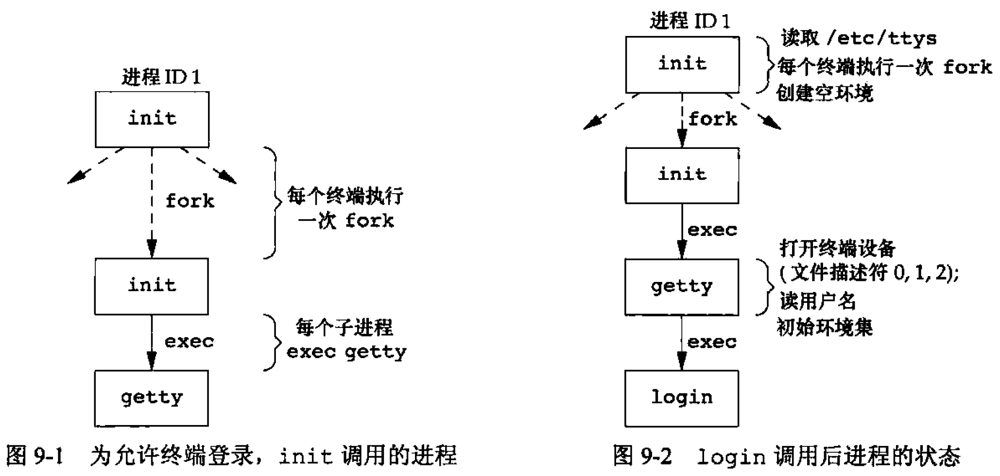
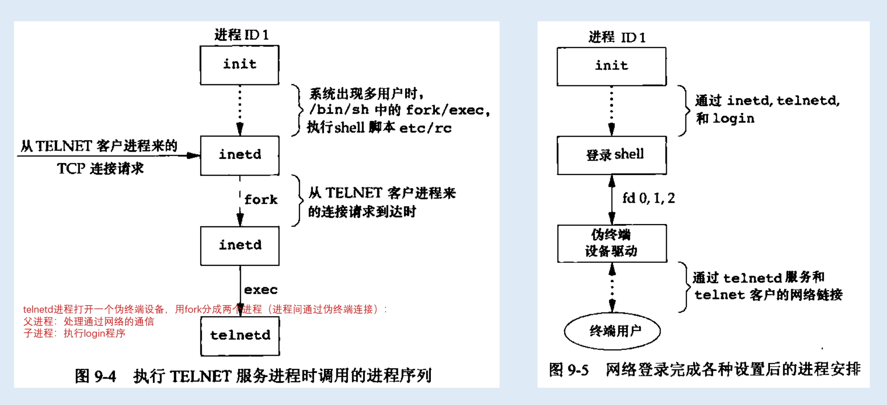
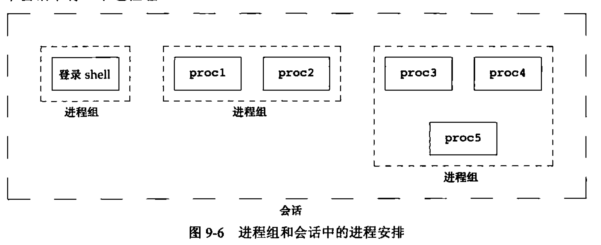
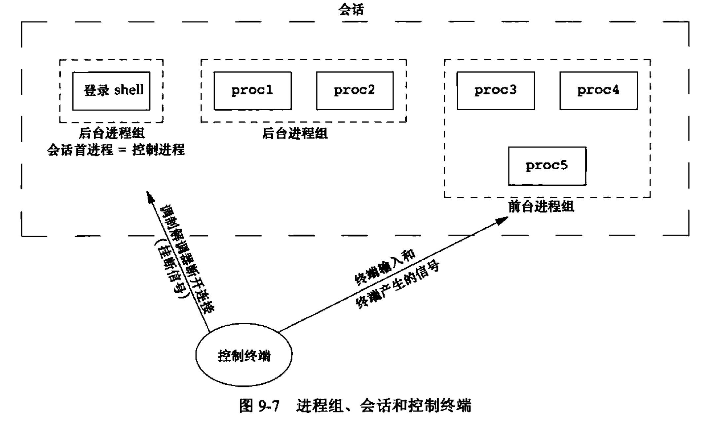
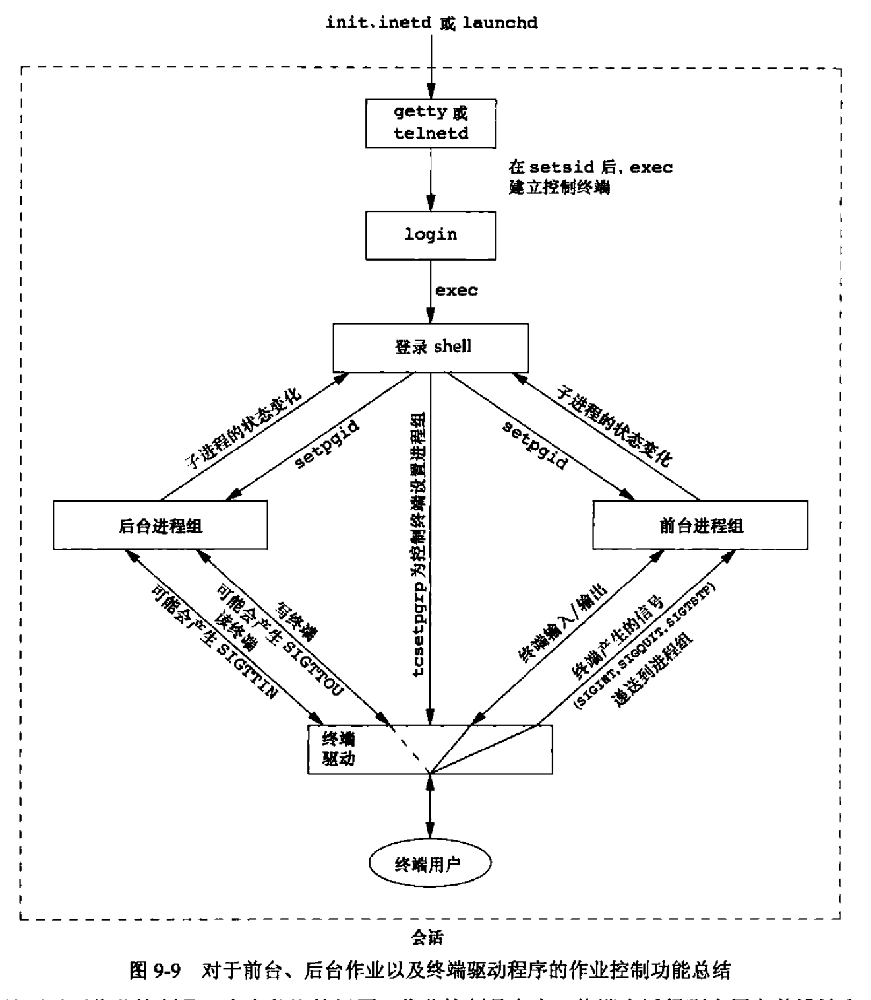
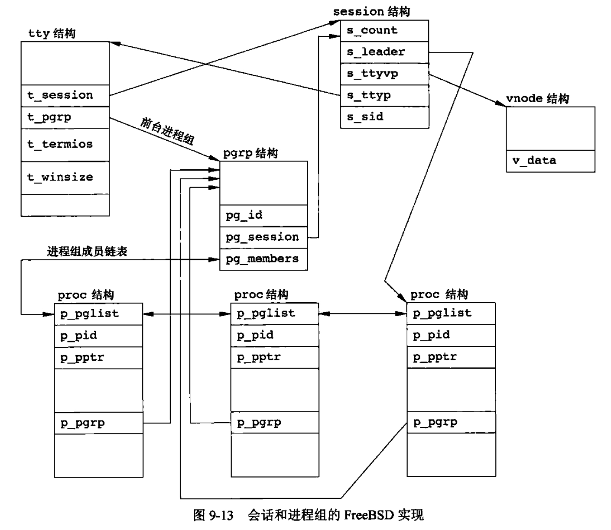

<h1 align="center">📒 第 09 章 进程关系 学习笔记</h1>


## 1. 终端登录
现目前使用的终端可以是基于字符的终端、仿真基于字符终端的图形终端、运行窗口系统的图形终端。

### 1.1 BSD终端登录
系统管理者创建通常名为 `/etc/ttys` 的文件。每个终端设备都有一行，每一行说明设备名和传到 `getty` 程序的参数。

login 被调用后，进程的状态：



- init 进程具有超级用户特权。
- login可处理的事项：

    - 调用`getpwnam`获取到相应用户的口令文件登录项
    - 调用`getpass(3)`显示提示 “Password”
    - 调用crypt(3) 将用户键入的口令加密，并与该用户在阴影口令文件中的登录项的 pw_passwd 字段比较。
    - 用户键入口令无效，则login会调用exit表示登录失败。

UNIX 系统支持传统的用户身份验证过程。在现代UNIX支持多种方式。如果一个用户正确登录后，login继续完成如下工作：

- 将当前工作目录更改为用户的起始目录。
- 调用 `chown` 更改终端的所有权，使登录用户成为它的所有者。
- 将对该终端设备的访问权限改变成 “用户读和写”。
- 调用 `setgid` 及 `initgroups`设置进程的组ID。
- 用`login` 得到的所有信息初始化环境：`起始目录（HOME）`、`shell（SHELL）`、`用户名（USER 和 LOGNAME）`以及`一个系统默认路径（PATH）`。
- `login`进程更改为登录用户的用户ID（`setuid`）并调用该用户的登录shell。

### 1.2 MAC OS X 终端登录
MAC OS X部分基于FreeBSD，与BSD终端登录的进程工作步骤一致，但是MAC OS X 也有增加新的特性：

- init 的工作是 launched 完成。
- 图形终端


### 1.3 Linux终端登录
登录过程类似BSD，都是使用init的启动方式。但是不同的Linux发行版本做了新的更新方式。


### 1.4 Solaris 终端登录
支持两种方式：

- `getty` 方式：与BSD的方式一致。
- `ttymon` 登录，SVR4引入的新特性。

但一般 `getty` 用于控制，`ttynom` 用于其它终端的登录。

## 2. 网络登录
通过串行终端登录至系统和经由网络登录至系统两者之间的主要区别是：

- 网络登录时，在终端和计算机之间的连接不再是点对点。
- 所有登录都由内核的网络接口驱动程序，事先并不知道会有多少类似的登录。

为使同一个软件既能处理`终端登录`，又能处理`网络登录`，则使用`伪终端`的软件驱动程序。


### 2.1 BSD 网络登录
inetd 进程负责等待大多数网络连接。init调用shell后，使其执行shell脚本 `/etc/rc `，等待shell启动一个守护进程 inetd（如果shell脚本终止，inet的父进程会变成init）等待TCP/IP连接请求到主机，当一个连接请求到达时，它执行一次fork，生成的子进程exec适当的程序。




当使用网络登录或终端登录时，都会得到一个登录shell，其标准输入、标准输出和标准错误要么连接设备，要么连接到伪终端设备上。


### 2.2 MAC OS X 、Linux、Solaris 网络登录
- MAC OS X telnetd 守护进程由 launched 运行。

- Linux 和BSD 相同，只不过使用了特定的进程对其进行精细化的网络登录管理。

- Solaris 与BSD、Linux方式基本一样。


## 3. 进程组
进程组是一个或多个进程的集合。每个进程组有一个唯一的进程组ID。进程组ID是一个正整数，可存放在 pid_t 数据类型中。使用 getpgrp 可以获取调用进程的进程组ID：

```c
#include <unistd.h>

pid_t getpgrp(void);
```

每个进程组有一个组长进程。组长进程的进程组ID等于其进程ID。

进程调用 setpgrp 可以加入一个现有的进程组或者创建一个新进程组。

```c
#include <unistd.h>

int setpgrp(pid_t pid, pid_t pgid);
```

- pid 和 pgid 相等，则由pid指定的进程变成进程组组长。

- pid为0，使用调用者的进程ID。

- gpid 为 0，则由pid指定的进程ID用作进程组ID。

## 4. 会话

会话（session）是一个或多个进程组的集合。



- 一般是shell的管道将几个进程编排成一组。

建立会话的函数：

```c
#include <unistd.h>

pid_t setsid(void);
// 成功返回进程组ID，失败则返回-1。
```

获取会话首进程的进程组ID的函数：

```c
#include <unistd.h>

pid_t getsid(pid_t pid);
// 成功返回会话首进程的进程组ID，出错返回-1
```

- pid 为 0，getsid返回调用进程的会话首进程的进程组ID。

## 5. 控制终端

会话和进程组的特性关系和说明如下：



- 一个会话可以有一个控制终端。
    - 一般是终端设备（终端登录）或伪终端设备（网络登录）。

- 建立与控制终端连接的会话首进程称为控制进程。

- 一个会话中的几个进程组可被分为一个前台进程组以及一个或多个后台进程组。

- 如果一个会话有一个控制终端，则它有一个前台进程组，其他为后台进程组。

- 中断键都会将中断信号发送给前台进程组的所有进程。

- 退出键都会将退出信号发送给前台进程组的所有进程。

- 如果终端接口检测到调制解调器（或网络）已断开，则将挂断信号发送至控制进程（会话首进程）。


## 6. 函数 `tcgetpgrp`、`tcsetpgrp` 和 `tcgetsid`
通知内核哪一个进程组是前台进程组的函数：

```c
#include <unistd.h>

pid_t tcgetpgrp(int fd); // 成功返回前台进程组ID，失败返回-1

int tcsetpgrp(int fd, pid_t pgrpid); // 成功返回0，失败返回-1
```

通过控制TTY的文件描述符，使用 tcgetsid 函数，则可以获得会话首进程组的进程组ID：

```c
#include <termios.h>

pid_t tcgetsid(int fd);
// 成功，返回会话首进程的进程组ID，出错返回-1。
```

## 7. 作业控制
作业控制是1980年BSD中增加的特性。允许一个终端上启动多个作业，控制哪一个作业可以访问该终端以及哪些作业在后台运行。

作业控制要求3种形式的支持：

- 支持作业控制的shell
- 内核中的终端驱动程序必须支持作业控制。
- 内核必须提供某些作业控制信号的支持。

3种特殊字符可使终端驱动程序产生信号，将它们发送至前台进程组。

- 中断字符（一般用 `Delete` 或 `Ctrl + C`）产生`SIGINT`。
- 退出字符（一般用 `Ctrl + \`）产生`SIGQUIT`。
- 挂起字符（一般用 `Ctrl + Z`）产生`SIGTSTP`。


功能总结：




## 8. shell执行程序
ps 进程和shell命令是位于同一会话和前台进程组。

如果一个后台进程试图读其控制终端，则会发生什么？例：

```shell
cat > temp.foo &
```

在进行作业控制是，后台作业被放在后台进程组，如果后台作业试图读控制终端，则会产生信号`SIGTTIN`。在没有作业控制时，其处理方式：

- 如果该进程没有重定向标准输入时，则shell自动将后台进程的标准输入重定向到 `/dev/null` 中。读 `/dev/null` 则产生一个文件结束。

## 9. 孤儿进程组
一个其父进程已终止的进程称为**`孤儿进程（orphan process）`**。由`init`进程收养。

```c
#include <stdio.h>
#include <stdlib.h>
#include <unistd.h>
#include <signal.h>
#include <errno.h>

static void sig_hup(int signo)
{
    printf("SIGHUP received, pid = %ld\n", (long)getpid());
}

static void pr_ids(char *name) {
    printf("%s: pid = %ld, ppid = %ld, pgrp = %ld, tprgp = %ld\n", name, 
        (long)getpid(), (long)getppid(), (long)getpgrp(), (long)tcgetpgrp(STDIN_FILENO));
    fflush(stdout);
}

int main(void)
{
    char c;
    pid_t pid;

    pr_ids("parent");
    if ((pid == fork()) < 0) {
        printf("fork error\n");
    } else if (pid > 0) { /* parent */
        sleep(5);
    } else {
        pr_ids("child");
        signal(SIGHUP, sig_hup); // establish signal handler
        kill(getpid(), SIGTSTP); // stop ourself
        pr_ids("child");
        if (read(STDIN_FILENO, &c, 1) != 1) {
            printf("read error %d on controlling TTY\n", errno);
        }
    }
    exit(0);
}
```


## 10. FreeBSD实现

FreeBSD中使用的各种数据结构：



- session 结构体：
    - s_count：该会话的进程组数。当计数器减少至0时，则释放此结构。
    - s_leader：指向会话中首进程proc结构的指针。
    - s_ttyvp：指向控制终端vnode结构的指针。
    - s_ttyp：指向控制终端tty结构的指针。
    - s_sid：会话ID


- tty结构体：每个终端设备和每个伪终端设备均会分配此结构。

    - t_session：指向此终端作为控制终端的session结构。
    - t_pgrp：指向前台进程组的pgrp结构。
    - t_termios：包含所有这些特殊字符和与此终端有关信息的结构。
    - t_winsize：包含终端窗口当前大小的winsize型结构。

为了找到特定会话的前台进程组，内核从session结构开始，然后用 s_ttyp 得到控制终端的tty结构，再用 t_pgrp 得到前台进程组的pgrp结构。

- pgrp结构体：包含特定进程组的信息。

    - pg_id：进程组ID
    - pg_session：指向此进程组所属会话的session结构。
    - pg_memeber：指向此进程组 `proc` 结构表的指针，`proc`结构代表进程组的成员。

- proc结构体：一个进程的所有信息。

    - p_pid：进程ID
    - p_pptr：指向父进程proc结构的指针。
    - p_pgrp：指向本进程所属的进程组的pgrp结构的指针。
    - p_pglist：是一个结构，包含两个指针，分别指向进程组中上一个和下一个进程。

- vnode结构
    - 进程对 `/dev/tty` 的所有访问都通过 vnode 结构。


## 11. 习题

待更新